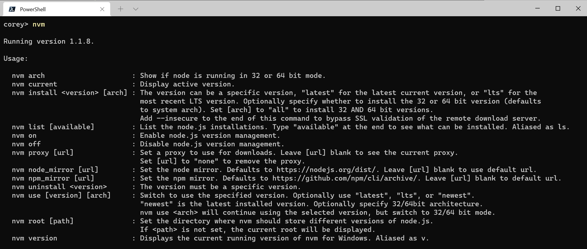

+++
title = "nvm-windows"
date = 2023-07-06T21:08:46+08:00
weight = 10
type = "docs"
description = ""
isCJKLanguage = true
draft = false

+++

# NVM for Windows

> 原文：[https://github.com/coreybutler/nvm-windows](https://github.com/coreybutler/nvm-windows)


​	这是[Microsoft](https://docs.microsoft.com/en-us/windows/nodejs/setup-on-windows)/[npm](https://docs.npmjs.com/cli/v9/configuring-npm/install#windows-node-version-managers)/[Google](https://cloud.google.com/nodejs/docs/setup#installing_nvm)推荐的用于**Windows**的Node.js版本管理器。

> **这不是nvm！**
>
> ​	*原始的[nvm](https://github.com/nvm-sh/nvm)是一个仅适用于Mac/Linux的完全独立项目。*这个项目采用了完全不同的理念，不仅仅是nvm的克隆。详情请参阅[为什么需要另一个版本管理器？](#-为什么需要另一个版本管理器)和[有什么重大区别？](#-有什么重大区别)。

**遇到问题了吗？**请查看[常见 issues wiki](https://github.com/coreybutler/nvm-windows/wiki/Common-Issues)。

寻求反馈：我们正在开发NVM for Windows的后继版本[Runtime (rt)](https://github.com/coreybutler/nvm-windows/wiki/Runtime)。请花一分钟时间填写[此表单](https://t.co/oGqQCM9FPx)来做出贡献。谢谢！


## 概述

​	在Windows计算机上管理多个Node.js安装。

**tl;dr** 类似于[nvm](https://github.com/creationix/nvm)，但适用于Windows。有安装程序。[立即下载](https://github.com/coreybutler/nvm-windows/releases)！

​	此工具始终是一个Node.js版本管理器，而不是io.js管理器，因此不支持io.js的向后兼容。支持Node 4+。请记住，在运行`nvm install`或`nvm use`时，Windows通常需要管理员权限（以创建符号链接）。



​	在某些情况下，切换不同版本的Node.js可以非常有用。例如，如果您想要使用最新的前沿版本来测试您正在开发的模块，而不需要卸载稳定版本的Node，此工具可以帮助您。


### 安装与升级

#### ⭐ ⭐ 卸载任何现有的Node安装！⭐ ⭐

​	在安装NVM for Windows之前，请卸载任何现有的Node.js版本（否则会有版本冲突）。删除可能仍存在的任何现有Node.js安装目录（例如`%ProgramFiles%\nodejs`）。NVM生成的符号链接不会覆盖现有的（即使是空的）安装目录。

👀 **备份任何全局`npmrc`配置** 👀（例如`%AppData%\npm\etc\npmrc`）

​	或者，将设置（the settings）复制到用户配置`%UserProfile%\.npmrc`中。删除现有的npm安装位置（例如`%AppData%\npm`）以防止全局模块冲突。

#### 安装 nvm-windows

​	使用[最新的安装程序](https://github.com/coreybutler/nvm/releases)（带有卸载程序）。或者，按照[手动安装](https://github.com/coreybutler/nvm-windows/wiki#manual-installation)指南进行操作。

​	*如果安装后 NVM4W 看起来无法立即工作，请重新启动终端/PowerShell（而不是整个计算机）。*


#### 重新安装任何全局工具

​	安装后，需要为每个已安装的Node.js版本重新安装全局工具（例如yarn）：

```bash
nvm use 14.0.0
npm install -g yarn
nvm use 12.0.1
npm install -g yarn
```

### 升级 nvm-windows

💡 *从 v1.1.8 开始，这里有一个升级工具可自动执行升级过程*

**要升级 nvm-windows**，运行新的安装程序。它将安全地覆盖需要更新的文件，而不会影响到您的node.js安装。确保您使用相同的安装和符号链接文件夹。如果您最初安装到默认位置，则只需在每个窗口上点击“下一步”直到完成即可。

### 使用方法

​	**nvm-windows在管理员Shell中运行**。您需要以管理员身份启动`powershell`或命令提示符来使用nvm-windows。

​	NVM for Windows是一个命令行工具。在控制台中键入`nvm`以获取帮助。基本命令如下： 

- **`nvm arch [32|64]`**：显示node运行在32位还是64位模式下。指定32或64来覆盖默认架构。
- **`nvm check`**：检查NVM4W进程是否存在已知问题。
- **`nvm current`**：显示当前活动版本。
- **`nvm install <version> [arch]`**：版本可以是特定版本，"latest"表示最新版本，"lts"表示最新的LTS版本。可选择指定安装32位或64位版本（默认为系统架构）。将[arch]设置为"all"以安装32位和64位版本。在此命令的末尾添加`--insecure`可以绕过远程下载服务器的SSL验证。
- **`nvm list [available]`**：列出已安装的node.js版本。在末尾输入`available`以显示可供下载的版本列表。
- **`nvm on`**：启用node.js版本管理。
- **`nvm off`**：禁用node.js版本管理（不会卸载任何内容）。
- **`nvm proxy [url]`**: 设置用于下载的代理。将 `[url]` 留空以查看当前代理。将 `[url]` 设置为 "none" 以移除代理。
- **`nvm uninstall <version>`**: 卸载特定版本。
- **`nvm use <version> [arch]`**: 切换到指定版本。可选使用 `latest`、`lts` 或 `newest`。`newest` 是最新的 *已安装* 版本。可选指定 32 位/64 位架构。`nvm use <arch>` 将继续使用选定的版本，但切换到 32 位/64 位模式。关于在特定目录中使用 `use`（或使用 `.nvmrc`）的信息，请参考[issue #16](https://github.com/coreybutler/nvm-windows/issues/16)。
- **`nvm root <path>`**: 设置 nvm 应存储不同版本的 node.js 的目录。如果未设置 `<path>`，将显示当前根目录。
- **`nvm version`**: 显示当前运行的 NVM for Windows 版本。
- **`nvm node_mirror <node_mirror_url>`**: 设置 node 镜像。中国用户可以使用 *https://npmmirror.com/mirrors/node/*
- **`nvm npm_mirror <npm_mirror_url>`**: 设置 npm 镜像。中国用户可以使用 *https://npmmirror.com/mirrors/npm/*

### ⚠️ Gotcha!  - 注意！

​	请注意，您可能安装的任何全局 npm 模块**不会**在您安装的各个 node.js 版本之间共享。此外，某些 npm 模块可能不支持您使用的 node 版本，因此请注意您的环境。

### 📛 Antivirus - 杀毒软件

​	用户报告了使用杀毒软件（特别是 McAfee）时遇到一些问题。似乎杀毒软件正在操作对 VBScript 引擎的访问。有关详细信息和解决方法，请参阅[issue #133](https://github.com/coreybutler/nvm-windows/issues/133)。

​	**v1.1.8 没有代码签名**，但所有其他版本均由[Ecor Ventures LLC](https://ecorventures.com/) / [Author.io](https://author.io/)签名。这应该有助于防止大多数杀毒软件产生错误的阳性结果。

> 由于证书过期，v1.1.8+ 没有进行代码签名（请参阅[发布说明](https://github.com/coreybutler/nvm-windows/releases/tag/1.1.8)以获取详细原因）。**v1.1.9已经进行了代码签名**，感谢[ajyong](https://github.com/ajyong)赞助了新的证书。

### 使用 Yarn

**tldr;** `npm i -g yarn`

​	请参阅[wiki](https://github.com/coreybutler/nvm-windows/wiki/Common-Issues#how-do-i-use-yarn-with-nvm-windows)获取详细信息。

### 从源代码构建

- 从[http://golang.org](http://golang.org/)安装 Go。
- 下载源代码/克隆仓库。
- 如果想要构建 64 位可执行文件，请在 build.bat 中将 GOARCH 更改为 amd64。
- 在 Windows 命令提示符中切换到项目目录。
- 执行 `go get github.com/blang/semver`。
- 执行 `go get github.com/olekukonko/tablewriter`。
- 执行 `build.bat`。
- 检查 `dist` 目录中生成的安装程序。

------

## 💡 为什么需要另一个版本管理器？

​	有几个用于 Node.js 的版本管理器。像 [nvm](https://github.com/creationix/nvm) 和 [n](https://github.com/tj/n) 这样的工具只适用于 Mac OSX 和 Linux。那么 Windows 用户呢？难道只能望洋兴叹？并非如此。[nvmw](https://github.com/hakobera/nvmw) 和 [nodist](https://github.com/marcelklehr/nodist) 都是专为 Windows 设计的。那么，为什么还需要另一个 Windows 版本管理器呢？

​	大多数 Windows 上的 Node 版本管理器的架构依赖于 `.bat` 文件，这些文件通过一些巧妙的技巧来设置或模拟环境变量。其中一些使用 node 自身（一旦下载完成），这是令人钦佩的，但也容易出现问题。大约在 node 0.10.30 附近，安装结构发生了一些变化，导致其中一些工具在处理新版本时停止工作。

​	此外，一些用户在安装这些模块时遇到困难，因为这需要对 node 的安装结构有更多了解。我相信，如果人们能更容易地在不同版本之间切换，他们可能会花时间在不同版本上测试他们的代码，这是一个良好的实践。

## 💡 有什么重大区别？

​	首先，这个版本的 nvm 不依赖于 node。它是使用[Go](https://golang.org/)编写的，这是一种比在受限制的 `.bat` 文件中进行操作更为结构化的方法。它不依赖于现有的 node 安装。Go 提供了在同一代码库上创建 Mac/Linux 版本的能力。事实上，这已经在进行中。

​	控制机制也非常不同。一般来说，支持多个 node 安装和热切换能力有两种一般方法。第一种是在切换版本时修改系统的 `PATH`，或者通过使用 `.bat` 文件来模拟 node 可执行文件并进行相应的重定向。这在我看来总是有点hackish，并且由于这种实现方式的一些怪癖而存在一些问题。

​	第二种选择是使用符号链接（symlink）。这个概念需要将符号链接放在系统的 `PATH` 中，然后更新其目标为您想要使用的 node 安装目录。这是一个直接的方法，似乎是人们推荐的... 直到他们意识到在 Windows 上使用符号链接是多么麻烦。这就是为什么之前从未发生过的原因。

​	为了创建/修改符号链接，您必须作为管理员运行，并且必须解决 Windows UAC（讨厌的提示）的问题。幸运的是，这是我在[node-windows](https://github.com/coreybutler/node-windows)的一些辅助脚本中已经解决的挑战。因此，NVM for Windows 维护了一个放置在系统 `PATH` 中的单个符号链接，仅在安装过程中放置。切换到不同版本的 Node 只需要切换符号链接目标。因此，此工具**不**需要您每次打开一个控制台窗口时都运行 `nvm use x.x.x`。当您运行 `nvm use x.x.x` 时，所有打开的控制台窗口上的活动 Node 版本都会自动更新。它还会在系统重新启动时持久保存，因此您只需要在想要进行更改时使用 nvm。

​	NVM for Windows 包含一个安装程序，这是我在[Fenix Web Server](https://preview.fenixwebserver.com/)上工作的副产品。

​	总的来说，这个项目集合了一些想法，一些经过历练的其他模块的可靠部分，并支持更新的 node 版本。

NVM for Windows recognizes the "latest" versions using a [list](https://nodejs.org/download/release/index.json) provided by the Node project. Version 1.1.1+ use this list. Before this list existed, I was scraping releases and serving it as a standalone [data feed](https://github.com/coreybutler/nodedistro). This list was used in versions 1.1.0 and prior, but is now deprecated.

​	NVM for Windows 使用由 Node 项目提供的[列表](https://nodejs.org/download/release/index.json)来识别"latest"版本。版本 1.1.1+ 使用此列表。在此列表存在之前，我正在爬取发布并将其作为独立的[数据源](https://github.com/coreybutler/nodedistro)提供。这个列表在版本 1.1.0 和之前使用，但现在已经不推荐使用。=>疑问，列表是哪个列表，不推荐使用？

## 动机

​	我需要它，简单明了。此外，显然 [对多版本的支持](https://github.com/nodejs/node-v0.x-archive/issues/8075)不会加入到 node 核心。这也是一个借口让我玩一下 Go。

## 为什么选择 Go？为什么不选择 Node？

​	我选择 Go 是因为它是跨平台的，感觉比 Java 的开销小，比大多数人想象的时间更长。此外，我想用它做一些实验。有人问我为什么不使用 node 来编写。我觉得用你想要安装的工具来编写工具是没有意义的。因此，我对这个项目的要求很简单... 不是 node 的东西。node 将继续发展和变化。如果您需要提醒，请记住 io.js、Ayo、4.x.x 和 6.x.x 之间的所有重大更改，以及 12+ 中的 ES 模块的转变。在软件世界中，变化是不可避免的。JavaScript 是非常动态的。

## 🙏 Thanks

​	感谢所有在 Github 内外提交问题、提出建议和帮助改进该项目的人。特别感谢： 

- [@vkbansal](https://github.com/vkbansal)，在早期版本中提供了重要的反馈意见。
- [@rainabba](https://github.com/rainabba) 和 [@sullivanpt](https://github.com/sullivanpt)，将对 Node v4 的支持集成到了项目中。
- [@s-h-a-d-o-w](https://github.com/s-h-a-d-o-w)，解决了长期存在的路径名中的空格转义问题（[#355](https://github.com/coreybutler/nvm-windows/pull/355)）。
- [ajyong](https://github.com/ajyong)，在 2021 年末赞助了代码签名证书。


