+++
title = "安装1.2.2版本"
date = 2026-03-01T12:37:06+08:00
weight = 0
type = "docs"
description = ""
isCJKLanguage = true
draft = false

+++

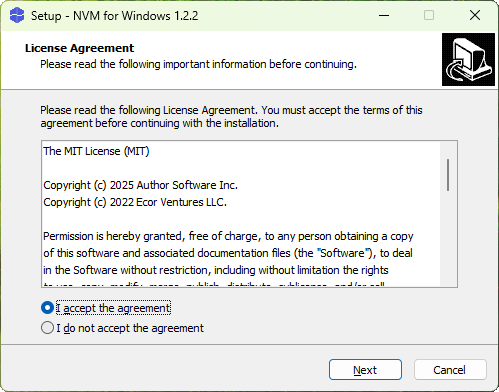


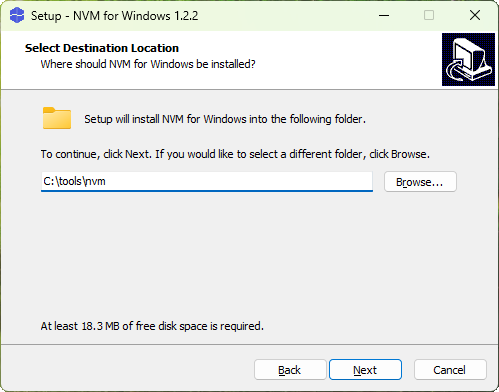

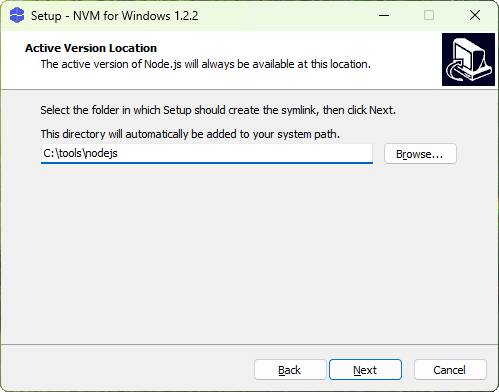

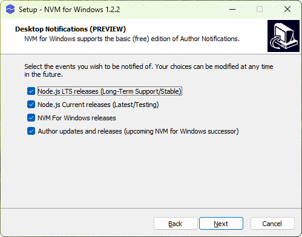


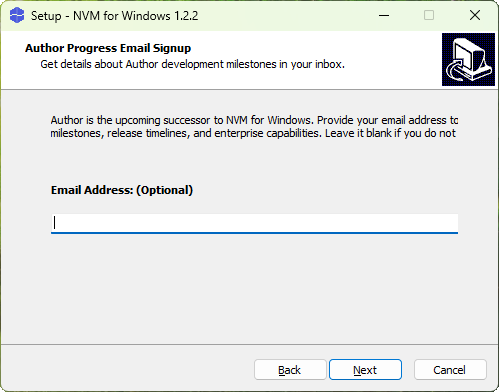

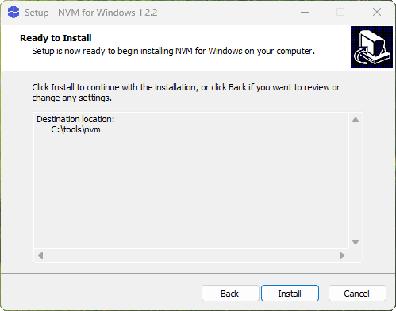

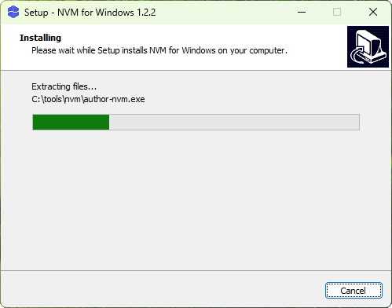

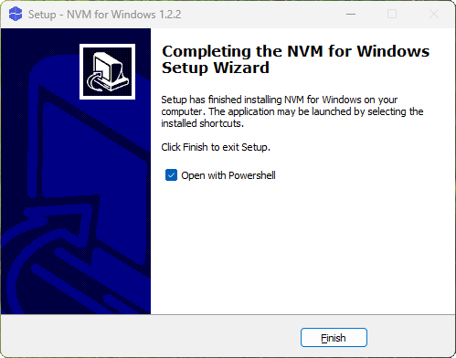


```sh
nvm list available
```

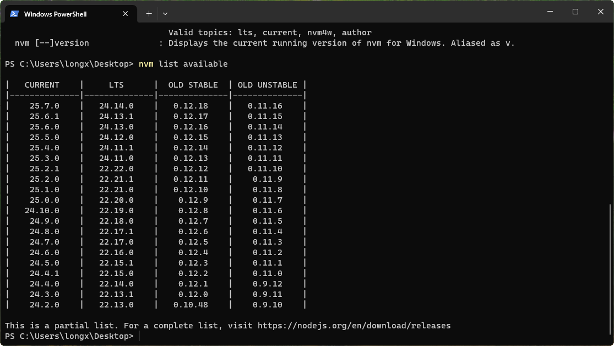

```sh
nvm install 24.14.0
```

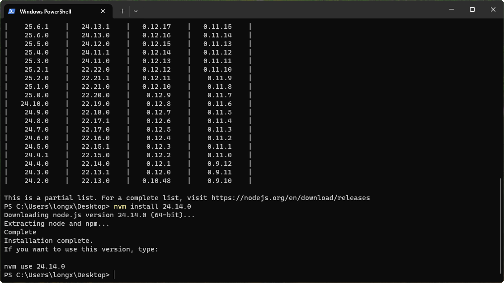

```sh
nvm use 24.14.0
```

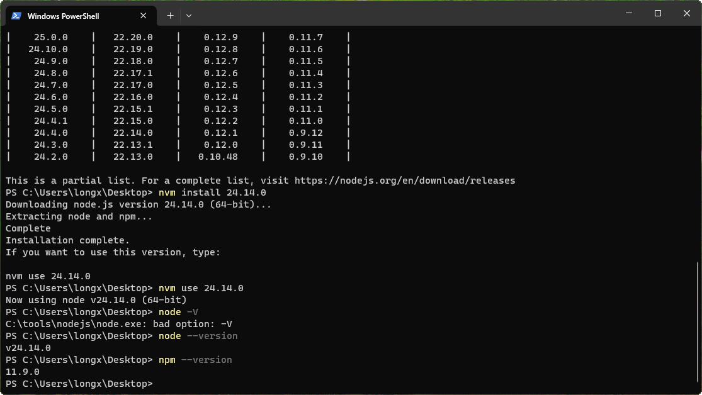