+++
title = "install_7_5_4"
date = 2026-03-01T13:01:15+08:00
weight = 0
type = "docs"
description = ""
isCJKLanguage = true
draft = false
+++

[https://github.com/PowerShell/PowerShell/releases](https://github.com/PowerShell/PowerShell/releases)

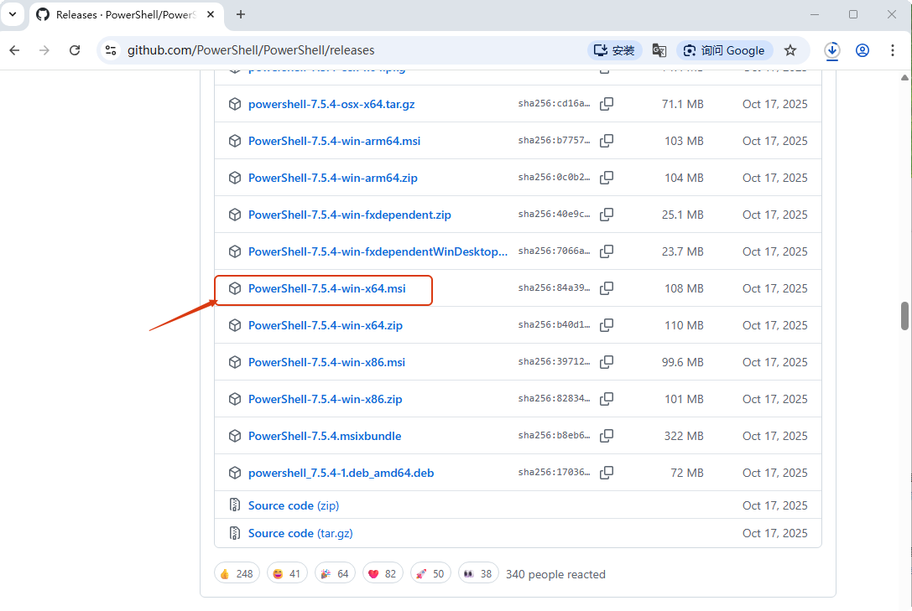

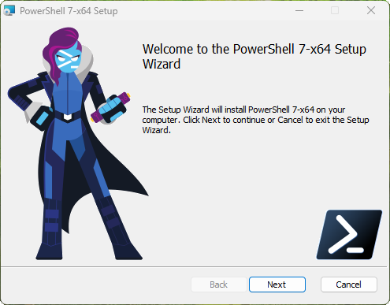

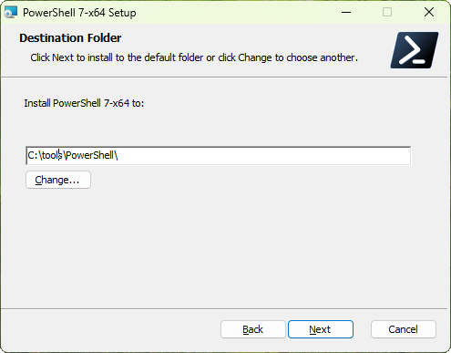

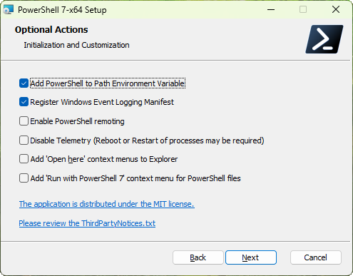

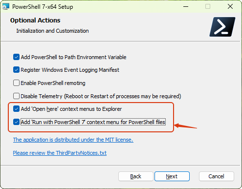

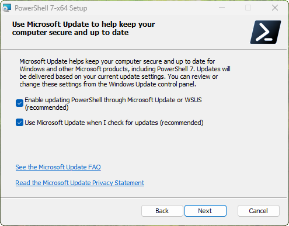

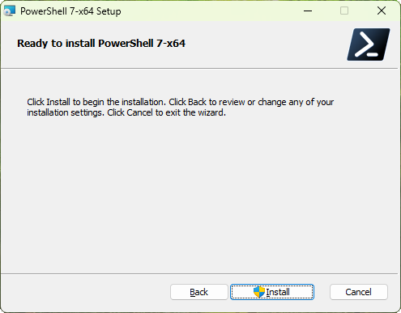

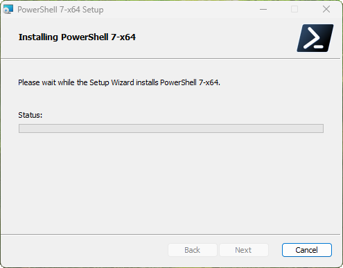

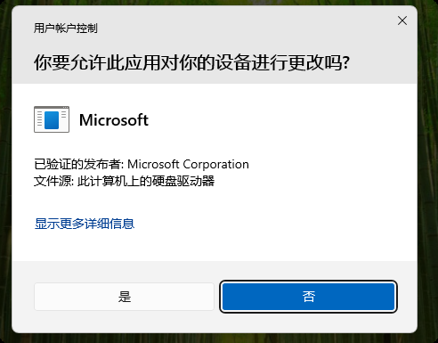

选择`是`

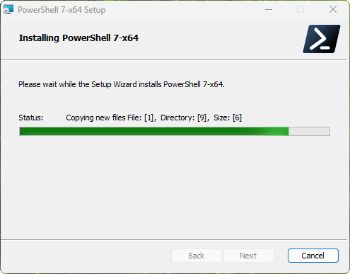

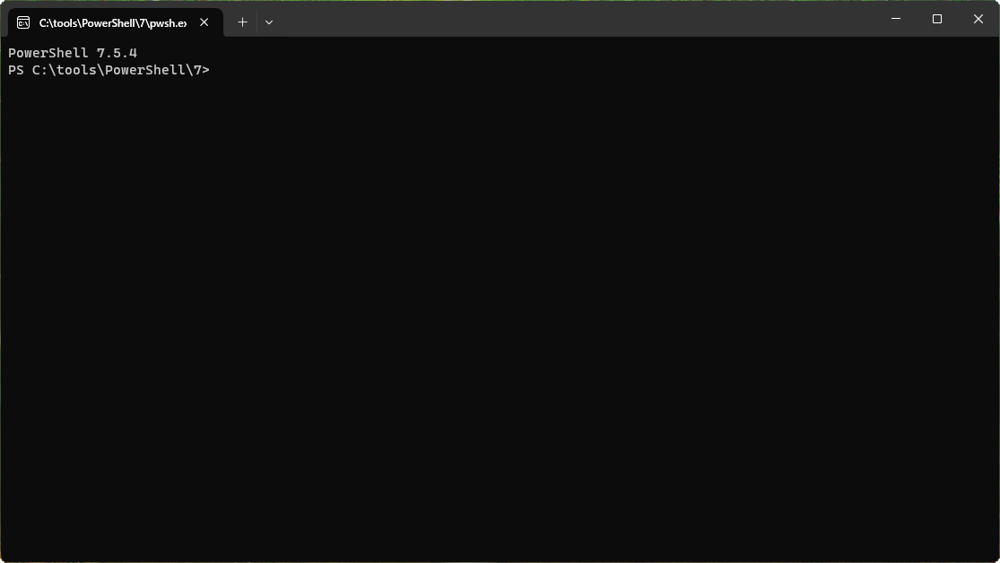

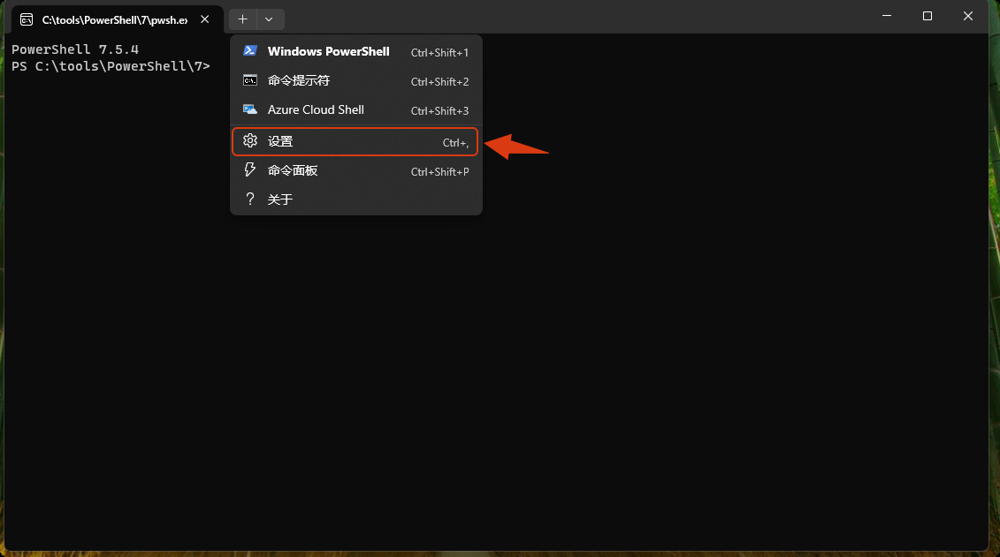

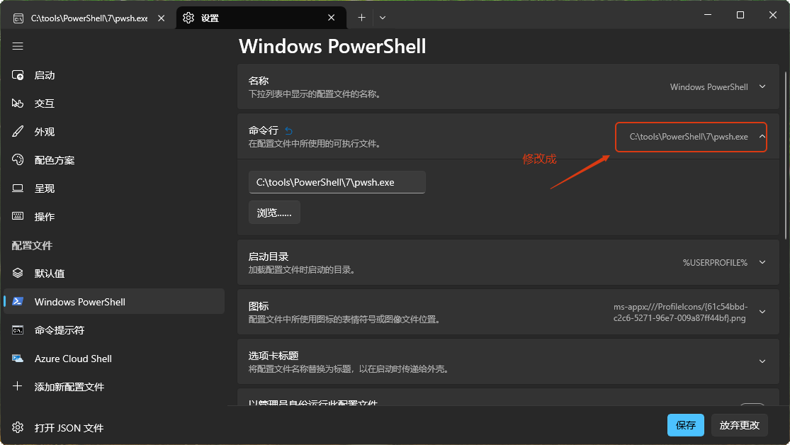