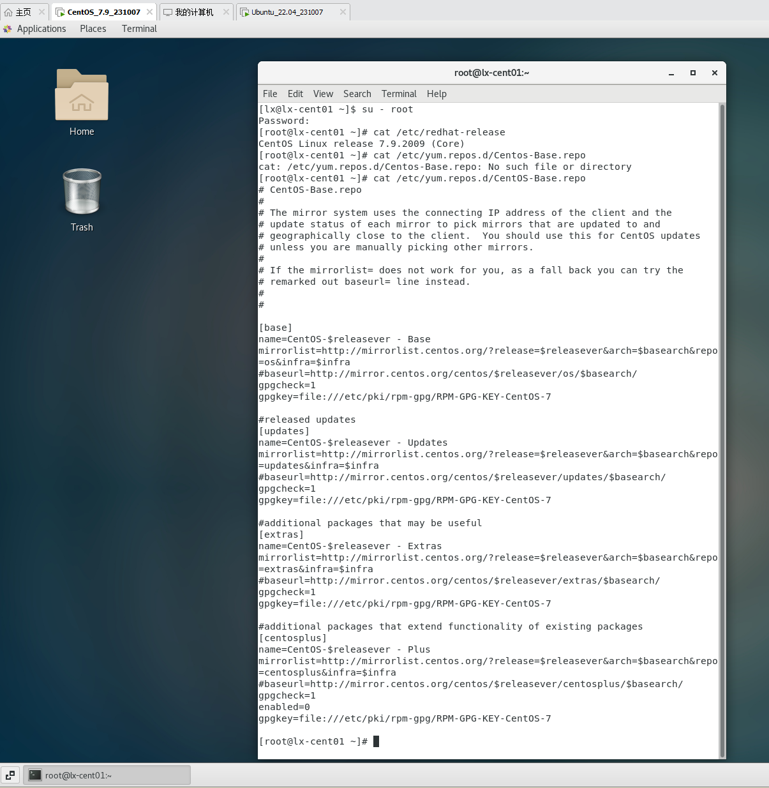
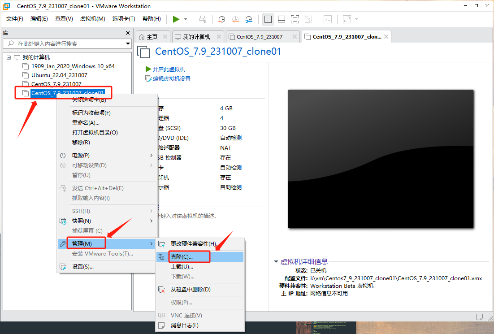

+++
title = "在VMware Workstation 16 上安装 Centos7.9"
date = 2023-10-07T11:27:22+08:00
weight = 0
type = "docs"
description = ""
isCJKLanguage = true
draft = false

+++

# 在VMware Workstation 16 上安装 Centos7.9

## CentOS7.9 安装包

- [https://mirrors.aliyun.com/centos/7.9.2009/isos/x86_64/](https://mirrors.aliyun.com/centos/7.9.2009/isos/x86_64/) 阿里镜像
- [https://mirrors.tuna.tsinghua.edu.cn/centos/7.9.2009/isos/x86_64/](https://mirrors.tuna.tsinghua.edu.cn/centos/7.9.2009/isos/x86_64/) 清华源
- [https://mirrors.ustc.edu.cn/centos/7.9.2009/isos/x86_64/](https://mirrors.ustc.edu.cn/centos/7.9.2009/isos/x86_64/) 中科大源
- [https://img.cs.montana.edu/linux/centos/7.9.2009/isos/x86_64/](https://img.cs.montana.edu/linux/centos/7.9.2009/isos/x86_64/)
- [https://mirrors.tripadvisor.com/centos/7.9.2009/isos/x86_64/](https://mirrors.tripadvisor.com/centos/7.9.2009/isos/x86_64/)

## 相关资源

- [https://installati.one/centos/7/](https://installati.one/centos/7/) 相关软件的安装说明

## 前期设置


## 开始安装


## 更新yum源和升级

```bash
su - root

# 备份原有的yum源配置文件
mv /etc/yum.repost.d/CentOS-Base.repo /etc/yum.repos.d/CentOS-Base.bak

# 使用阿里云的yum源，获取新的配置文件
wget -O /etc/yum.repos.d/CentOS-Base.repo https://mirrors.aliyun.com/repo/Centos-7.repo

# 作用：清除yum缓存。 yum 会把下载的软件包和header存储在cache中，而不自动删除
yum clean all

# 升级包、软件和系统内核,而 yum -y upgrade只升级包，而不升级软件和系统内核
yum -y update
```




## 安装 vmware-tools


在输入以下命令行：

```bash
mkdir -p /mnt/cdrom

mount /dev/cdrom /mnt/cdrom

cp /mnt/cdrom/VMwareTools-10.3.23-16594550.tar.gz /tmp

umount /dev/cdrom

tar -zxvf VMwareTools-10.3.23-16594550.tar.gz

cd /tmp/vmware-tools-distrib/

./vmware-install.pl

# 出现 [yes] 则输入 yes
# 出现 [no] 则直接按Enter
```


## 安装和更新epel源

epel（Extra Packages for Enterprise Linux）是一个软件源，里面包含了许多基本源中不存在的软件。

它由Fedora Project 推出。

网址：[http://fedoraproject.org/wiki/EPEL](http://fedoraproject.org/wiki/EPEL)

```bash
# 安装
yum install -y epel-release

# 备份
cd /etc/yum.repos.d
mv epel.repo epel.repo.bak

# 获取新的epel.repo
wget -O epel.repo https://mirrors.aliyun.com/repo/epel-7.repo

```


## 设置关屏时间为Never


## 设置中文输入法


## 克隆 <- 重要




## 安装搜狗输入法  <-  待处理（目前重启后还是有问题）

```bash
#
yum -y install fcitx-configtool libQtWebKit* fcitx im-chooser fcitx-qt5

# 
yum -y install alien dpkg

# 切换至 /tmp
cd /tmp

# 怎么获取不同版本？
wget http://cdn2.ime.sogou.com/dl/index/1524572264/sogoupinyin_2.2.0.0108_amd64.deb

# 
alien -r --scripts sogoupinyin_2.2.0.0108_amd64.deb

# 强行安装sogou
rpm -ivh --force sogoupinyin-2.2.0.0108-2.x86_64.rpm

# 
cp /usr/lib/x86_64-linux-gnu/fcitx/fcitx-sogoupinyin.so /usr/lib64/fcitx/

# 切换输入法为fcitx
imsettings-switch fcitx  

# 弹出输入法配置框
fcitx-configtool

# 重新启动
reboot
```

