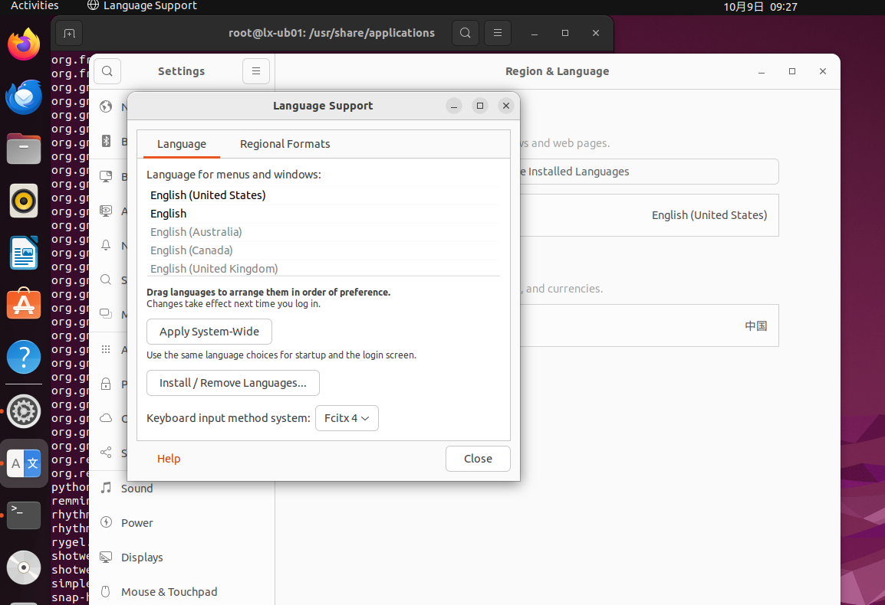

+++
title = "在VMware Workstation 16 上安装 Ubuntu 22.04"
date = 2023-10-07T11:27:40+08:00
weight = 0
type = "docs"
description = ""
isCJKLanguage = true
draft = false

+++

# 在VMware Workstation 16 上安装 Ubuntu 22.04

## Ubuntu 22.04安装包

- [https://mirrors.aliyun.com/ubuntu-releases/22.04.3/](https://mirrors.aliyun.com/ubuntu-releases/22.04.3/) 阿里镜像
- [https://mirrors.ustc.edu.cn/ubuntu-releases/22.04.3/](https://mirrors.ustc.edu.cn/ubuntu-releases/22.04.3/) 中科大源

- https://img.cs.montana.edu/linux/ubuntu/22.04.2/

## 相关资源

- [https://installati.one/ubuntu/22.04/](https://installati.one/ubuntu/22.04/) 相关软件的安装说明

## 前期设置


## 开始安装


## 设置关屏时间为Never


## 更新源和升级

```bash
sudo su - root

cd /etc/apt
# 备份
cp sources.list sources.list.bak

vim sources.list
# (a) 之后输入
:1,$s/cn.archive.ubuntu/mirrors.aliyun/

# (b) 以及输入
:1,$s/http:/https:/

# (c) 这样就完成了将 http://cn.archive.ubuntu.com 替换为 https://mirrors.aliyun.com

# 用于更新系统软件包列表。它会从软件包源下载最新的软件包信息，并将其存储在本地缓存中。
apt update

# 用于升级已安装的软件包。它会从本地缓存中下载最新版本的软件包，并将其安装到系统中。
apt upgrade -y

# 修复并安装损坏或不完整的软件包
apt -f install
```


## 安装 language support


## 安装 vmware-tools

```bash
sudo su - root

apt install open-vm-tools open-vm-tools-desktop
```


重启Ubuntu


## 安装 vim

```bash
sudo apt install vim
```


## 安装搜狗输入法

​	目前搜狗输入法已经发布了 `sogoupinyin_4.2.1.145_amd64.deb`，但也只能使用 fcitx，而不能使用fcitx4或fcitx5（有一点不明白，明明使用`apt install fcitx -y`，但安装完后，在Language Support中的 Keyboard input method system的选项中却是fcitx4）。

```bash
sudo su - root

# 安装 fcitx
apt install fcitx -y

# 找到 fcitx.desktop 这个文件
find / -name "fcitx.desktop"
# 设置fcitx开机自启动
cp fcitx.desktop /etc/xdg/autostart/

# 通过图像界面将 Keyboard input method system设置为 Fcitx 4

# 下载 搜狗输入法安装包
cd /tmp

# 目前由于ime-sec.gtimg.com 好像只能通过浏览器进行下载，故以下命令执行时会出现： 403 Forbidden
wget https://ime-sec.gtimg.com/202310080913/f5ea3033a4ceaeede447551bb82ebd1c/pc/dl/gzindex/1680521603/sogoupinyin_4.2.1.145_amd64.deb

# 那就通过Ubuntu上自带的firefox浏览器进行下载，下载后存放的路径为 /home/登录用户名/Downloads，我的登录名为 lx，您需要根据自己的登录名进行替换：
mv /home/lx/Downloads/sogoupinyin_4.2.1.145_amd64.deb /tmp

# 使用dpkg命令进行安装
dpkg -i sogoupinyin_4.2.1.145_amd64.deb

# 若重新启动Ubuntu
# reboot
# 此时sogoupinyin 虽然在屏幕的右上角有显示但还不能使用

# 卸载系统ibus输入法框架
apt purge ibus

# 顺便执行下 以下命令用于清除不需要的依赖项
apt-get autoremove

# 此时还是不能使用 sogoupinyin
# 还需要安装搜狗输入法的依赖
apt install libqt5qml5 libqt5quick5 libqt5quickwidgets5 qml-module-qtquick2 -y

apt install libgsettings-qt1 

# 重新启动Ubuntu
reboot
```

设置 Keyboard input method system为 Fcitx 4



选择x86_64


未重新启动Ubuntu的情况下


重新启动Ubuntu的情况下


最终重启Ubuntu后


## 防火墙设置

查看防火墙状态

```cmd
sudo ufw status
```

> 注：一般情况下防火墙是默认已经安装好的

安装和卸载防火墙

```cmd
# 安装
sudo apt install ufw -y
# 安装好的防火墙默认是 inactive 的状态

# 卸载
# 注意，这样卸载并不会删除之前设置好的防火墙规则
sudo apt remove ufw -y
```

启用防火墙

```cmd
sudo ufw enable
```

禁用防火墙

```cmd
sudo ufw disable
```

临时停用防火墙

```cmd
sudo systemctl stop ufw
```

设置允许通过防火墙的规则

添加端口

```cmd
sudo ufw allow 端口号

# 或

sudo ufw allow 端口号/协议

# 或
sudo ufw allow 起始端口号:末尾端口号

# 或
sudo ufw allow 起始端口号:末尾端口号/协议
```

例如：

```cmd
sudo ufw allow 22
sudo ufw allow 22/tcp
sudo ufw allow 22/udp

sudo ufw allow 8000:8888
sudo ufw allow 8000:8888/tcp
```

去除端口

```cmd
sudo ufw delete allow 端口号

# 或
sudo ufw delete allow 端口号/协议

# 或
sudo ufw delete allow 起始端口号:末尾端口号

# 或
sudo ufw delete allow 起始端口号:末尾端口号/协议
```

例如：

```cmd
sudo ufw delete allow 22
sudo ufw delete allow 22/tcp
sudo ufw delete allow 22/udp

sudo ufw delete allow 8000:8888
sudo ufw delete allow 8000:8888/tcp
```


## 安装 OpenSSH 服务器

```cmd
# 查看系统是否安装了 OpenSSH 服务器
# 若以下命令有输出，则表示已经安装了
dpkg -l | grep openssh-server

# 安装 OpenSSH 服务器
sudo apt update
sudo apt install -y openssh-server

# 检查 SSH 服务状态
sudo systemctl status ssh

# 获取 Ubuntu 主机的 IP 地址
ip a

# 停止 SSH 服务
sudo systemctl stop ssh

# 禁用 SSH 服务
sudo systemctl disable ssh

# 启用 SSH 服务
sudo systemctl enable ssh

# 启动 SSH 服务
sudo systemctl start ssh
```

## 升级 Snap Store

```
# 这将检查 Snap Store 是否有可用的更新，并自动将其升级到最新版本
sudo snap refresh snap-store

# 若遇到以下错误：
# error: cannot refresh "snap-store": snap "snap-store" has running apps (snap-store),pids: 2151 或其他 pids
# 则先执行 sudo kill 2151 或 其他 pids
# 再执行sudo snap refresh snap-store
```


## 克隆 <- 重要


## 安装 docker

参考：[https://developer.aliyun.com/mirror/docker-ce?spm=a2c6h.13651102.0.0.57e31b114DANS4](https://developer.aliyun.com/mirror/docker-ce?spm=a2c6h.13651102.0.0.57e31b114DANS4)

```cmd
sudo su - root
# 卸载旧版本
for pkg in docker.io docker-doc docker-compose docker-compose-v2 podman-docker containerd runc; do sudo apt-get remove $pkg; done

#  安装必要的一些系统工具
apt-get update
apt-get -y install apt-transport-https ca-certificates curl software-properties-common

# 安装GPG证书
curl -fsSL https://mirrors.aliyun.com/docker-ce/linux/ubuntu/gpg | sudo apt-key add -
# 写入软件源信息
add-apt-repository "deb [arch=amd64] https://mirrors.aliyun.com/docker-ce/linux/ubuntu $(lsb_release -cs) stable"

# 用于更新系统软件包列表。它会从软件包源下载最新的软件包信息，并将其存储在本地缓存中。
apt-get -y update

# 安装最新版本的docker-ce
apt-get install docker-ce docker-ce-cli containerd.io docker-buildx-plugin docker-compose-plugin

# 检查当前安装的最新docker-ce的版本
docker version
```


## 安装 docker desktop

参考：[https://docs.docker.com/desktop/install/ubuntu/](https://docs.docker.com/desktop/install/ubuntu//)

参考：https://docs.docker.com/desktop/get-started/#credentials-management-for-linux-users

```
sudo su - root

# 切换至 /tmp
cd /tmp

# 根据https://docs.docker.com/desktop/install/ubuntu/，下载到最新的deb安装包,
curl -fsSL "https://desktop.docker.com/linux/main/amd64/139021/docker-desktop-4.28.0-amd64.deb?utm_source=docker&utm_medium=webreferral&utm_campaign=docs-driven-download-linux-amd64&_gl=1*17uhrl4*_ga*NDUwMjA5NDQ2LjE3MTI0NzYzNzE.*_ga_XJWPQMJYHQ*MTcxMjQ3NjM3MC4xLjEuMTcxMjQ3NjM4My40Ny4wLjA." -o docker-desktop-4.28.0-amd64.deb

apt-get install ./docker-desktop-4.28.0-amd64.deb

# 安装一款VPN，例如： https://repo.trojan-cdn.com/clash-verge/Clash%20Verge%20v1.3.8/
curl -fL "https://repo.trojan-cdn.com/clash-verge/Clash%20Verge%20v1.3.8/clash-verge_1.3.8_amd64.deb" -o clash-verge_1.3.8_amd64.deb

dpkg -i clash-verge_1.3.8_amd64.deb

# 使用 docker login 登入时，遇到错误，参考：https://docs.docker.com/desktop/get-started/#credentials-management-for-linux-users

# 生成 gpg key
gpg --generate-key

# 输入 real name, 个人邮箱后，按照提示 移动鼠标或敲击键盘可以让生成public and secret key 更加随机。

pass init <your_generated_gpg-id_public_key>

# 其中的<your_generated_gpg-id_public_key>，例如 /home/lx/.gnupg/openpgp-revocs.d/DC52BE5CFFF02AFF9F5EA2EB528D238AFBE0070D.rev
# 完整的命令例如，pass init /home/lx/.gnupg/openpgp-revocs.d/DC52BE5CFFF02AFF9F5EA2EB528D238AFBE0070D.rev
# 如此一来，会自动将该 <your_generated_gpg-id_public_key> 上传到 你的账户底下。
# 接着使用 docker login 就可以登入成功

# 若需要 在docker desktop 上登入账号，一定记得先配置代理
```


打开docker desktop可能会遇到：Virtualisation support


你需要在虚拟机中开启以下设置：


使用`IMPORT`导入Clash托管配置链接


打开`System Proxy`


选择 `Proxies`中的`Rule`下的Proxy中的任意一个节点


打开docker desktop，设置 `Proxies`


