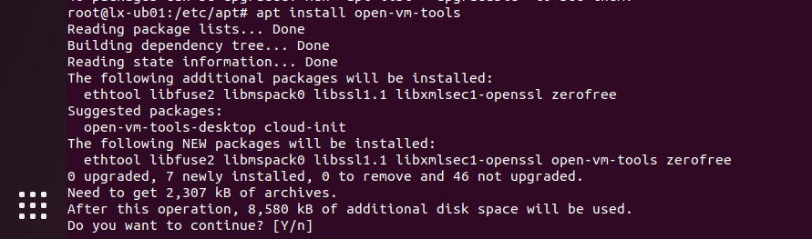

+++
title = "在VMware Workstation 16 上安装 Ubuntu 22.04"
date = 2023-10-07T11:27:40+08:00
weight = 0
type = "docs"
description = ""
isCJKLanguage = true
draft = false

+++

# 在VMware Workstation 16 上安装 Ubuntu 22.04

## Ubuntu 22.04安装包

- [https://mirrors.aliyun.com/ubuntu-releases/22.04.3/](https://mirrors.aliyun.com/ubuntu-releases/22.04.3/) 阿里镜像
- [https://mirrors.ustc.edu.cn/ubuntu-releases/22.04.3/](https://mirrors.ustc.edu.cn/ubuntu-releases/22.04.3/) 中科大源

- https://img.cs.montana.edu/linux/ubuntu/22.04.2/

## 相关资源

- [https://installati.one/ubuntu/22.04/](https://installati.one/ubuntu/22.04/) 相关软件的安装说明

## 前期设置


## 开始安装


## 设置关屏时间为Never


## 更新源和升级

```bash
sudo su - root

cd /etc/apt
# 备份
cp source.list source.list.bak

vi source.list
# (a) 之后输入
:1,$s/cn.archive.ubuntu/mirrors.aliyun/

# (b) 以及输入
:1,$s/http:/https:/

# (c) 这样就完成了将 http://cn.archive.ubuntu.com 替换为 https://mirrors.aliyun.com

# 用于更新系统软件包列表。它会从软件包源下载最新的软件包信息，并将其存储在本地缓存中。
apt update

# 用于升级已安装的软件包。它会从本地缓存中下载最新版本的软件包，并将其安装到系统中。
apt upgrade -y

# 修复并安装损坏或不完整的软件包
apt -f install
```


## 安装 language support


## 安装 vmware-tools

```bash
sudo su - root

apt install open-vm-tools open-vm-tools-desktop
```




重启Ubuntu


## 安装 vim

```bash
sudo apt install vim
```


## 安装搜狗输入法

​	目前搜狗输入法已经发布了 `sogoupinyin_4.2.1.145_amd64.deb`，但也只能使用 fcitx，而不能使用fcitx4或fcitx5（有一点不明白，明明使用`apt install fcitx -y`，但安装完后，在Language Support中的 Keyboard input method system的选项中却是fcitx4）。

```bash
sudo su - root

# 安装 fcitx
apt install fcitx -y

# 设置fcitx开机自启动
cp fcitx.desktop /etc/xdg/autostart/

# 通过图像界面将 Keyboard input method system设置为 Fcitx 4

# 下载 搜狗输入法安装包
cd /tmp

# 目前由于ime-sec.gtimg.com 好像只能通过浏览器进行下载，故以下命令执行时会出现： 403 Forbidden
wget https://ime-sec.gtimg.com/202310080913/f5ea3033a4ceaeede447551bb82ebd1c/pc/dl/gzindex/1680521603/sogoupinyin_4.2.1.145_amd64.deb

# 那就通过Ubuntu上自带的firefox浏览器进行下载，下载后存放的路径为 /home/登录用户名/Downloads，我的登录名为 lx，您需要根据自己的登录名进行替换：
mv /home/lx/Downloads/sogoupinyin_4.2.1.145_amd64.deb /tmp

# 使用dpkg命令进行安装
dpkg -i sogoupinyin_4.2.1.145_amd64.deb

# 若重新启动Ubuntu
# reboot
# 此时sogoupinyin 虽然在屏幕的右上角有显示但还不能使用

# 卸载系统ibus输入法框架
apt purge ibus

# 顺便执行下 以下命令用于清除不需要的依赖项
apt-get autoremove

# 此时还是不能使用 sogoupinyin
# 还需要安装搜狗输入法的依赖
apt install libqt5qml5 libqt5quick5 libqt5quickwidgets5 qml-module-qtquick2 -y

apt install libgsettings-qt1 

# 重新启动Ubuntu
reboot
```

设置 Keyboard input method system为 Fcitx 4


选择x86_64


未重新启动Ubuntu的情况下


重新启动Ubuntu的情况下


最终重启Ubuntu后


## 克隆 <- 重要


