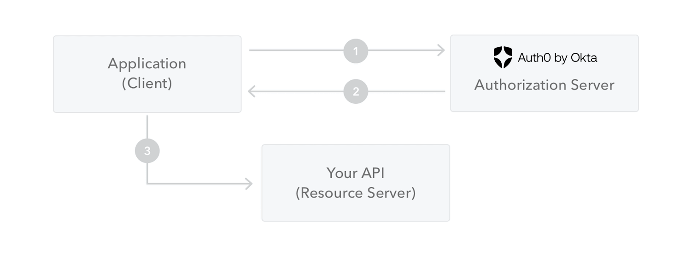

+++
title = "Introduction to JSON Web Tokens"
date = 2024-10-10T13:21:17+08:00
weight = 0
type = "docs"
description = ""
isCJKLanguage = true
draft = false

+++

## What is JSON Web Token?

JSON Web Token (JWT) is an open standard ([RFC 7519](https://tools.ietf.org/html/rfc7519)) that defines a compact and self-contained way for securely transmitting information between parties as a JSON object. This information can be verified and trusted because it is digitally signed. JWTs can be signed using a secret (with the **HMAC** algorithm) or a public/private key pair using **RSA** or **ECDSA**.

​	JSON Web Token (JWT) 是一种开放标准（[RFC 7519](https://tools.ietf.org/html/rfc7519)），它定义了一种紧凑且自包含的方式来在各方之间安全地传递信息，传递的信息以 JSON 对象的形式存在。由于 JWT 是经过数字签名的，所以可以验证信息并且确保信息可信。JWT 可以使用秘钥（通过 **HMAC** 算法）签名，或者通过 **RSA** 或 **ECDSA** 使用公私钥对进行签名。

Although JWTs can be encrypted to also provide secrecy between parties, we will focus on *signed* tokens. Signed tokens can verify the *integrity* of the claims contained within it, while encrypted tokens *hide* those claims from other parties. When tokens are signed using public/private key pairs, the signature also certifies that only the party holding the private key is the one that signed it.

​	尽管 JWT 可以加密来在双方之间提供保密性，但我们主要关注 *签名* 的令牌。签名的令牌可以验证其包含声明的 *完整性*，而加密的令牌则会 *隐藏* 声明。使用公私钥对签名时，签名还可以证明只有持有私钥的一方才能签署该令牌。

## 何时应该使用 JSON Web Tokens? When should you use JSON Web Tokens?

Here are some scenarios where JSON Web Tokens are useful:

​	以下是一些 JWT 的常用场景：

- **Authorization**: This is the most common scenario for using JWT. Once the user is logged in, each subsequent request will include the JWT, allowing the user to access routes, services, and resources that are permitted with that token. Single Sign On is a feature that widely uses JWT nowadays, because of its small overhead and its ability to be easily used across different domains.
- **授权**：这是使用 JWT 最常见的场景。用户登录后，每次后续请求都将包含 JWT，这使得用户可以访问使用该令牌授权的路径、服务和资源。单点登录（Single Sign On, SSO）是广泛使用 JWT 的一个特性，因其开销小且能够跨多个域轻松使用。

- **Information Exchange**: JSON Web Tokens are a good way of securely transmitting information between parties. Because JWTs can be signed—for example, using public/private key pairs—you can be sure the senders are who they say they are. Additionally, as the signature is calculated using the header and the payload, you can also verify that the content hasn't been tampered with.
- **信息交换**：JWT 是在各方之间安全传递信息的良好方式。因为 JWT 可以签名——例如，使用公私钥对签名——您可以确保发送方是他们所声明的身份。此外，由于签名是使用头部和载荷计算的，您还可以确保内容没有被篡改。

## JWT 的结构 What is the JSON Web Token structure?

In its compact form, JSON Web Tokens consist of three parts separated by dots (`.`), which are:

​	WT 由三部分组成，用点 (`.`) 分隔，分别是：

- Header 头部
- Payload 载荷 
- Signature 签名

Therefore, a JWT typically looks like the following.

​	JWT 通常看起来像这样：

```
xxxxx.yyyyy.zzzzz
```

Let's break down the different parts.

### 头部 Header

The header *typically* consists of two parts: the type of the token, which is JWT, and the signing algorithm being used, such as HMAC SHA256 or RSA.

For example:

​	头部通常包含两部分信息：令牌的类型（即 JWT）以及所使用的签名算法，例如 HMAC SHA256 或 RSA。示例：

```
{
  "alg": "HS256",
  "typ": "JWT"
}
```

Then, this JSON is **Base64Url** encoded to form the first part of the JWT.

​	这部分信息会使用 **Base64Url** 编码，形成 JWT 的第一部分。

### 载荷 Payload

The second part of the token is the payload, which contains the claims. Claims are statements about an entity (typically, the user) and additional data. There are three types of claims: *registered*, *public*, and *private* claims.

​	令牌的第二部分是载荷，载荷包含声明（claims）。声明是关于某个实体（通常是用户）和其他数据的陈述。声明有三种类型：*注册声明*、*公开声明* 和 *私有声明*。

- [**Registered claims**](https://tools.ietf.org/html/rfc7519#section-4.1): These are a set of predefined claims which are not mandatory but recommended, to provide a set of useful, interoperable claims. Some of them are: **iss** (issuer), **exp** (expiration time), **sub** (subject), **aud** (audience), and [others](https://tools.ietf.org/html/rfc7519#section-4.1).

- **[注册声明](https://tools.ietf.org/html/rfc7519#section-4.1)**：这些是一些预定义的声明，并非强制性的，但推荐使用。它们提供了一组有用的、可互操作的声明。例如：**iss**（签发者）、**exp**（过期时间）、**sub**（主题）和 **aud**（受众）。

  > Notice that the claim names are only three characters long as JWT is meant to be compact.

- [**Public claims**](https://tools.ietf.org/html/rfc7519#section-4.2): These can be defined at will by those using JWTs. But to avoid collisions they should be defined in the [IANA JSON Web Token Registry](https://www.iana.org/assignments/jwt/jwt.xhtml) or be defined as a URI that contains a collision resistant namespace.

- **[公开声明](https://tools.ietf.org/html/rfc7519#section-4.2)**：可以根据需要自定义，但为了避免冲突，最好在 [IANA JWT Registry](https://www.iana.org/assignments/jwt/jwt.xhtml) 中注册，或定义为包含冲突保护命名空间的 URI。

- [**Private claims**](https://tools.ietf.org/html/rfc7519#section-4.3): These are the custom claims created to share information between parties that agree on using them and are neither *registered* or *public* claims.

- **[私有声明](https://tools.ietf.org/html/rfc7519#section-4.3)**：这些是双方约定使用的声明，通常用于在两者之间共享信息，既非注册声明也非公开声明。

An example payload could be:

​	示例载荷：

```
{
  "sub": "1234567890",
  "name": "John Doe",
  "admin": true
}
```

The payload is then **Base64Url** encoded to form the second part of the JSON Web Token.

​	载荷也会被 **Base64Url** 编码，形成 JWT 的第二部分。

> Do note that for signed tokens this information, though protected against tampering, is readable by anyone. Do not put secret information in the payload or header elements of a JWT unless it is encrypted.

### 签名 Signature

To create the signature part you have to take the encoded header, the encoded payload, a secret, the algorithm specified in the header, and sign that.

​	要创建签名部分，需要将编码后的头部、编码后的载荷、一个密钥以及头部中指定的算法组合并进行签名。

For example if you want to use the HMAC SHA256 algorithm, the signature will be created in the following way:

​	例如，如果要使用 HMAC SHA256 算法，签名的创建方式如下：

```
HMACSHA256(
  base64UrlEncode(header) + "." +
  base64UrlEncode(payload),
  secret)
```

The signature is used to verify the message wasn't changed along the way, and, in the case of tokens signed with a private key, it can also verify that the sender of the JWT is who it says it is.

​	签名用于验证消息在传递过程中没有被更改，并且对于使用私钥签名的令牌，它还可以验证 JWT 的发送者是否是它声称的那一方。

### 整体流程 Putting all together

The output is three Base64-URL strings separated by dots that can be easily passed in HTML and HTTP environments, while being more compact when compared to XML-based standards such as SAML.

​	输出结果是三个用点分隔的 Base64-URL 字符串，可以很容易地在 HTML 和 HTTP 环境中传递，并且与基于 XML 的标准（如 SAML）相比更加紧凑。

The following shows a JWT that has the previous header and payload encoded, and it is signed with a secret. 

​	下图展示了一个已编码的 JWT，其中包括之前的头部和载荷，并使用密钥进行签名。


If you want to play with JWT and put these concepts into practice, you can use [jwt.io Debugger](https://jwt.io/#debugger-io) to decode, verify, and generate JWTs.

​	如果您想要尝试 JWT 并将这些概念付诸实践，您可以使用 [jwt.io 调试器](https://jwt.io/#debugger-io) 来解码、验证和生成 JWT。


## JSON Web Token 是如何工作的？ How do JSON Web Tokens work?

In authentication, when the user successfully logs in using their credentials, a JSON Web Token will be returned. Since tokens are credentials, great care must be taken to prevent security issues. In general, you should not keep tokens longer than required.

​	在身份验证中，当用户使用其凭证成功登录时，会返回一个 JSON Web Token。由于令牌本质上是凭证，因此必须非常小心，以防止安全问题。通常，您不应保留令牌超过所需的时间。

You also [should not store sensitive session data in browser storage due to lack of security](https://cheatsheetseries.owasp.org/cheatsheets/HTML5_Security_Cheat_Sheet.html#local-storage).

​	您还[不应将敏感的会话数据存储在浏览器存储中，因为它缺乏安全性](https://cheatsheetseries.owasp.org/cheatsheets/HTML5_Security_Cheat_Sheet.html#local-storage)。

Whenever the user wants to access a protected route or resource, the user agent should send the JWT, typically in the **Authorization** header using the **Bearer** schema. The content of the header should look like the following:

​	每当用户想要访问受保护的路由或资源时，用户代理应发送 JWT，通常在 **Authorization** 头中使用 **Bearer** 方案。头部的内容如下所示：

```
Authorization: Bearer <token>
```

This can be, in certain cases, a stateless authorization mechanism. The server's protected routes will check for a valid JWT in the `Authorization` header, and if it's present, the user will be allowed to access protected resources. If the JWT contains the necessary data, the need to query the database for certain operations may be reduced, though this may not always be the case.

​	在某些情况下，这可以是一种无状态的授权机制。服务器的受保护路由将检查 Authorization 头中是否有有效的 JWT，如果存在，用户将被允许访问受保护的资源。如果 JWT 包含必要的数据，可能会减少某些操作查询数据库的需求，尽管这并非总是如此。

Note that if you send JWT tokens through HTTP headers, you should try to prevent them from getting too big. Some servers don't accept more than 8 KB in headers. If you are trying to embed too much information in a JWT token, like by including all the user's permissions, you may need an alternative solution, like [Auth0 Fine-Grained Authorization](https://fga.dev/).

​	请注意，如果您通过 HTTP 头发送 JWT 令牌，应该尽量避免令牌过大。一些服务器不接受超过 8KB 的头信息。如果您尝试在 JWT 令牌中嵌入过多信息，比如包含所有用户的权限，您可能需要寻找替代解决方案，比如 [Auth0 精细授权](https://fga.dev/)。

If the token is sent in the `Authorization` header, Cross-Origin Resource Sharing (CORS) won't be an issue as it doesn't use cookies.

​	如果令牌通过 Authorization 头发送，跨域资源共享 (CORS) 将不是问题，因为它不使用 cookie。

The following diagram shows how a JWT is obtained and used to access APIs or resources:

​	下图展示了如何获取并使用 JWT 访问 API 或资源：



1. The application or client requests authorization to the authorization server. This is performed through one of the different authorization flows. For example, a typical [OpenID Connect](http://openid.net/connect/) compliant web application will go through the `/oauth/authorize` endpoint using the [authorization code flow](http://openid.net/specs/openid-connect-core-1_0.html#CodeFlowAuth). 应用程序或客户端向授权服务器请求授权。这通过不同的授权流程之一来完成。例如，典型的 [OpenID Connect](http://openid.net/connect/) 兼容的 Web 应用程序将通过 [授权码流程](http://openid.net/specs/openid-connect-core-1_0.html#CodeFlowAuth) 使用 `/oauth/authorize` 端点。
2. When the authorization is granted, the authorization server returns an access token to the application. 当授权被授予时，授权服务器将返回一个访问令牌给应用程序。
3. The application uses the access token to access a protected resource (like an API). 应用程序使用访问令牌访问受保护的资源（如 API）。

Do note that with signed tokens, all the information contained within the token is exposed to users or other parties, even though they are unable to change it. This means you should not put secret information within the token.

​	需要注意的是，对于签名令牌，令牌中包含的所有信息都会暴露给用户或其他方，尽管他们无法更改它。这意味着您不应在令牌中放入机密信息。

## 为什么要使用 JSON Web Tokens？ Why should we use JSON Web Tokens?

Let's talk about the benefits of **JSON Web Tokens (JWT)** when compared to **Simple Web Tokens (SWT)** and **Security Assertion Markup Language Tokens (SAML)**.

​	让我们谈谈 **JSON Web Tokens (JWT)** 与 **Simple Web Tokens (SWT)** 和 **安全断言标记语言令牌 (SAML)** 相比的好处。

As JSON is less verbose than XML, when it is encoded its size is also smaller, making JWT more compact than SAML. This makes JWT a good choice to be passed in HTML and HTTP environments.

​	由于 JSON 比 XML 更简洁，当其被编码时，大小也更小，使得 JWT 比 SAML 更加紧凑。这使得 JWT 在 HTML 和 HTTP 环境中传递时是一个不错的选择。

Security-wise, SWT can only be symmetrically signed by a shared secret using the HMAC algorithm. However, JWT and SAML tokens can use a public/private key pair in the form of a X.509 certificate for signing. Signing XML with XML Digital Signature without introducing obscure security holes is very difficult when compared to the simplicity of signing JSON.

​	从安全角度来看，SWT 只能通过 HMAC 算法使用共享密钥进行对称签名。然而，JWT 和 SAML 令牌可以使用 X.509 证书形式的公钥/私钥对进行签名。与签署 JSON 的简单性相比，使用 XML 数字签名对 XML 进行签名而不引入复杂的安全漏洞非常困难。

JSON parsers are common in most programming languages because they map directly to objects. Conversely, XML doesn't have a natural document-to-object mapping. This makes it easier to work with JWT than SAML assertions.

​	大多数编程语言中都支持 JSON 解析器，因为它们可以直接映射到对象。相比之下，XML 并没有自然的文档到对象的映射。这使得处理 JWT 比处理 SAML 断言更容易。

Regarding usage, JWT is used at Internet scale. This highlights the ease of client-side processing of the JSON Web token on multiple platforms, especially mobile.

​	在使用方面，JWT 在互联网规模下被广泛使用。这突显了 JSON Web Token 在多个平台（尤其是移动端）上客户端处理的便利性。

 *Comparison of the length of an encoded JWT and an encoded SAML*

​	*比较已编码的JWT和已编码的SAML的长度*

If you want to read more about JSON Web Tokens and even start using them to perform authentication in your own applications, browse to the [JSON Web Token landing page](http://auth0.com/learn/json-web-tokens) at Auth0 by Okta.

​	如果您想了解更多关于 JSON Web Tokens 的信息，甚至开始使用它们在自己的应用程序中执行身份验证，可以访问 Auth0 by Okta 提供的 [JSON Web Token 主页](http://auth0.com/learn/json-web-tokens)。