+++
title = "PS简介"
date = 2025-10-06T15:34:04+08:00
weight = 0
type = "docs"
description = ""
isCJKLanguage = true
draft = false

+++

## 移动工具

1. 移动工具在不同的文档窗口中进行移动相当于复制
   - 按住`Shift`键移动可以保留原来的位置【前提是两个文档大小一样】
   - 按住`Shift`键移动放到画布的中间位置 【两个文档大小不一样】
   - 按住`Shift`键移动放置选区中间的位置【画布中有选区存在】
2. 文档内移动
   - 根据自己选择的图层进行移动
   - 勾选自动选择，软件自动识别并选中对应图层
   - 【注】:在移动工具下，按住`Ctrl`键可以切换自动选择状态
   - 【注】:在其他工具状态下，按`Ctrl`键可以临时切换成移动工具
3. 移动工具的拓展操作
   - 移动工具状态下，按住`Alt键+鼠标左键`可以进行移动复制
   - 移动工具配合`Shift`键可以锁定方向进行移动
   - 移动工具配合键盘上下左右键可以进行微调(1像素) 再配合`Shift`键可以进行10个像素的移动
   - `Alt+Shift+光标键` 可以实现方向复制
4. 移动工具属性栏
   - 显示变换控件 
     - 对图层进行变换操作的外边框
   - 对齐和分布
     - 对齐至少两个
     - 分布至少三个

## 选框工具

​	**奔跑的蚂蚁线**

作用：在进行图片编辑时，可对图像局部像素进行处理。只对选区框选住的区域有效。

### 矩形选框工具

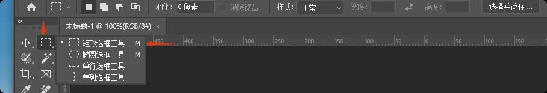

​	矩形选区

- 按住`Shift`键回执正方形选区
- 按住`Alt+Shift`键从中心开始绘制【先会出选区，再按住`Alt+Shift`键】

### 椭圆选框工具

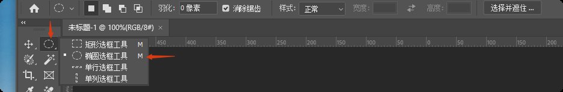

​	椭圆/正圆选区

- 按住`Shift`键绘制正圆
- 按住`Alt+Shift`键从中心开始绘制【先会出选区，再按住`Alt+Shift`键】

### 单行选框工具

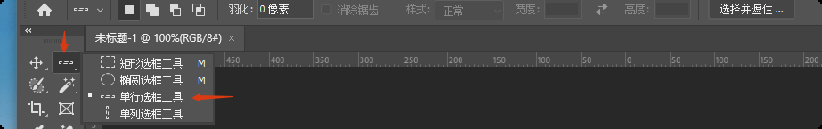

​	只绘制一个像素的高度的选区

### 单列选框工具

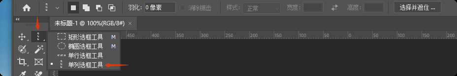

​	只绘制一个像素的宽度的选区

**选区的操作**

1. 移动选区

   - 在选框工具下可以直接移动选区，前提是选中

2. 取消选区

   - `Ctrl+D` 快捷键，或
   - 在选区选中的区域单击左键，前提是选中
   - 悬浮栏点击“取消选择”
   - 在选区以外的位置单击右键，在悬浮菜单中选择“取消选择”，或
   - 菜单栏--->选择--->取消选择，或

3. 上下文任务栏

   

**选区的加减法运算(布尔运算)**

1. 新选区 
2. 相加 
3. 减去 
4. 交叉 

**选区的羽化理解和操作技巧**

1. 羽化的原理
   - 令选区内外衔接部分虚化，起到渐变的作用从而达到自然衔接的效果
2.  操作技巧
   - 直接在属性栏设置好羽化值，然后再去绘制选区，或
   - 先绘制好选区后，`Shift+F6`进行羽化

## 套索工具组

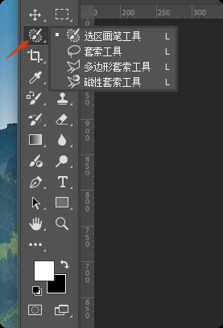

用来创建选区，创建选区后，`Ctr+J`直接就可以对选区部分复制出来，也就是抠图。

### 套索工具

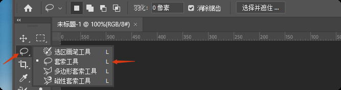

使用方法：按住鼠标左键随意绘制，类似画笔，松手后自动闭合成选区。

优点：速度快，可绘制任意形状。

缺点：选区创建不精准。

适用：对选区要求不高的图像，粗略操作。

### 多边形套索工具

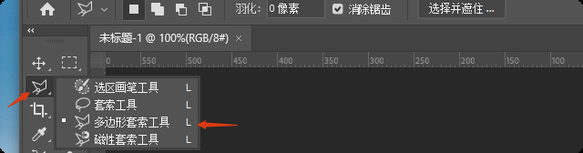

使用方法：鼠标左键依次单击，确定点位，绘制完后可双击闭合选区，或直接点击开始的点。

特点：绘制的是直线/有棱角的选区。

退回上一步：`Delete`键或者`Backspace`键。

控制方向：按住`Shift`。

适用：规则的几何图形。

终止：`Esc`键。

### 磁性套索工具

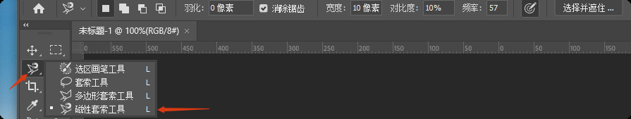

使用方法：鼠标左键单击后松手，沿着图像轮廓边缘游走，回到最开始的原点单击，形成闭合选区。

特点：软件自动识别边界。

优点：快速，自动识别。

缺点：选区绘制不够精确。

退回上一步：`Delete`键或者`Backspace`键。

终止：`ESC`键。

适用：边缘明显，色差明显的图像。

### 新增：选区画笔工具

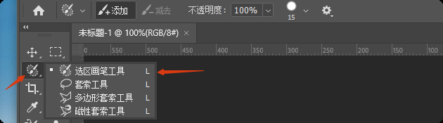

1. 类似于画笔的属性，可以调整大小和硬度
   - 调整选区画笔工具的大小:左右中括号键
2. 硬度控制的是边缘的软硬程度
3. 涂抹出来的区域相当于选区，也适用于选区的属性:修改、收缩、拓展......
4. 属性栏可以选择添加和减去
5. 涂抹完之后可以直接`Ctrl+J`复制，若涂抹完选择别的工具，则会变成选区

## 魔术棒工具组

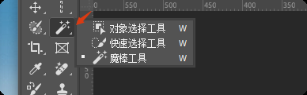

### 魔术棒工具

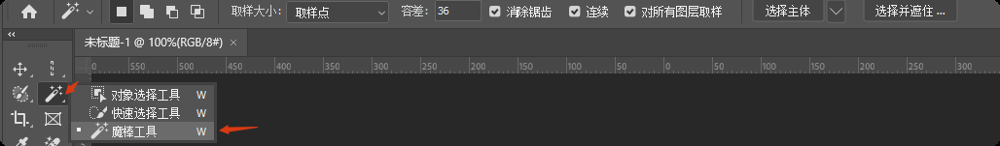

**取样大小**

1. 以单点像素取样
2. 容差：可以调节选区的范围，数值越大，识别范围也越大
3. 连续：只能选取连续的同样的像素
4. 对所有图层取样：可以选很多图层取样

> **总结**
>
> ​	这个工具主要适合背景比较单一或者边缘比较明显清晰的图像

### 对象选择工具

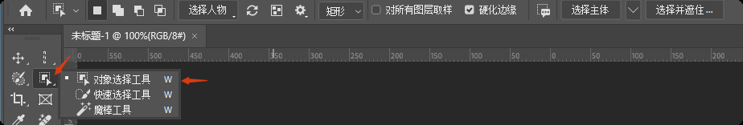

1. 可以直接把鼠标光标放在要处理的部分，鼠标左键单击，即可创建选区

2. 也可以鼠标左键长按框选区域，PS会自动识别主体部分并生成选区

### 快速选择工具

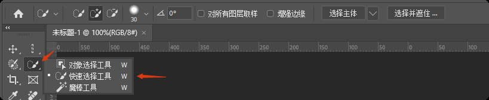

1. 加减模式切换：按住`Alt`键

2. 笔刷大小：表示识别的范围（快捷键放大缩小：左右中括号键）
   - 左中括号键（`[`）：缩小
   - 右中括号键（`]`）：放大

3. 硬度是指边缘的识别能力
4. 间距是指识别的连贯程度
5. 增强边缘：识别边缘的能力强

**通用属性**

- 选择并遮住

  > 前提：有选区的状态下
  >
  > 调整边缘画笔工具
  >
  > 用来调整边缘

## 裁剪工具

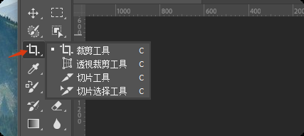

1. 拖动边界裁剪或者自定义边界
2. 按比例裁剪

3. 拉直操作(理解现实实物矫正)

   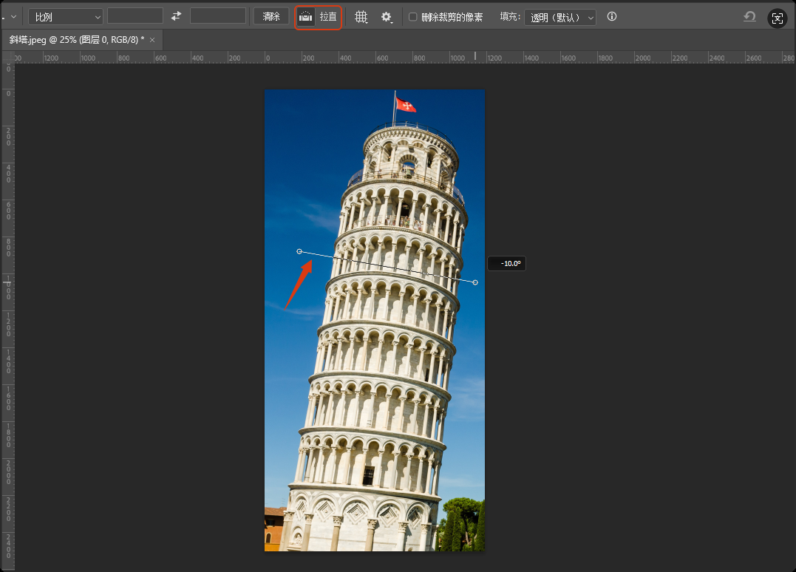

   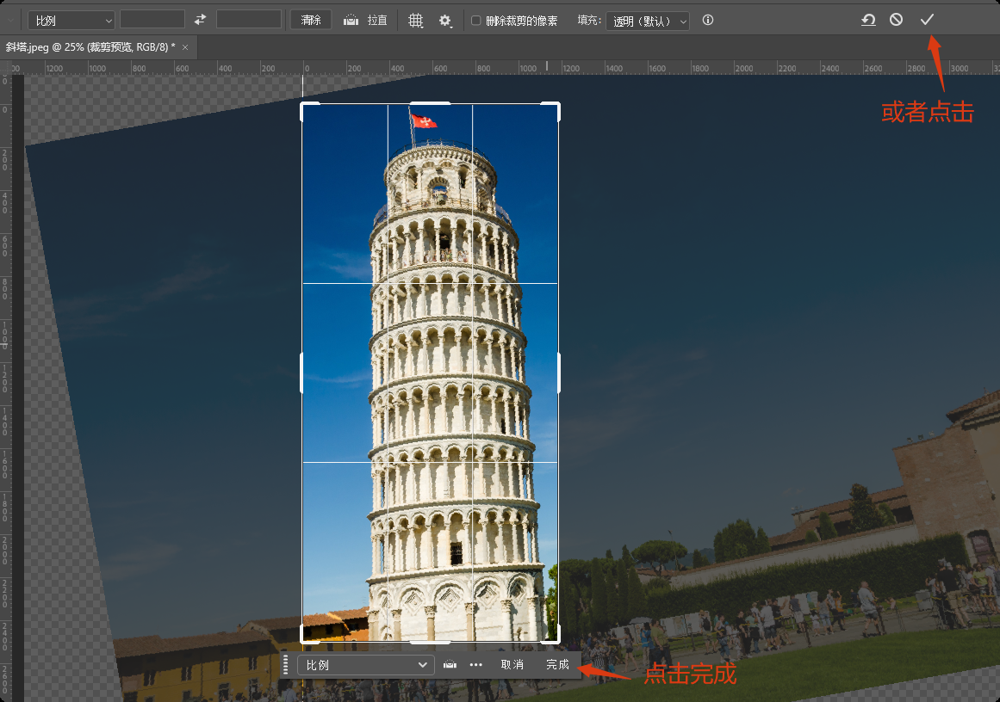

4. 裁剪后默认透明底

5. 裁剪选区，菜单“图像”-->“裁剪”

6. 透明裁切，菜单“图像”-->“裁切”

7. 透视裁剪工具
