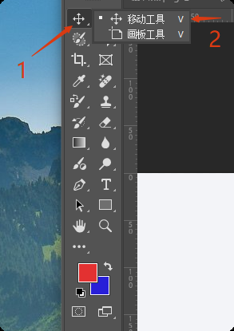
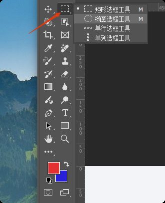
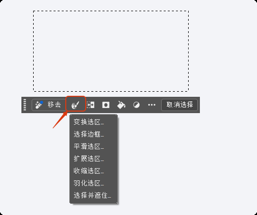

+++
title = "PS简介"
date = 2025-10-06T15:34:04+08:00
weight = 0
type = "docs"
description = ""
isCJKLanguage = true
draft = false

+++

## 移动工具

1. 移动工具在不同的文档窗口中进行移动相当于复制
   - 按住`shift`键移动可以保留原来的位置【前提是两个文档大小一样】
   - 按住`shift`键移动放到画布的中间位置 【两个文档大小不一样】
   - 按住`shift`键移动放置选区中间的位置【画布中有选区存在】
2. 文档内移动
   - 根据自己选择的图层进行移动
   - 勾选自动选择，软件自动识别并选中对应图层
   - 【注】:在移动工具下，按住`ctrl`键可以切换自动选择状态
   - 【注】:在其他工具状态下，按`ctrl`键可以临时切换成移动工具
3. 移动工具的拓展操作
   - 移动工具状态下，按住`alt键+鼠标左键`可以进行移动复制
   - 移动工具配合`shift`键可以锁定方向进行移动
   - 移动工具配合键盘上下左右键可以进行微调(1像素) 再配合`shift`键可以进行10个像素的移动
   - `alt+shift+光标键` 可以实现方向复制
4. 移动工具属性栏
   - 显示变换控件 
     - 对图层进行变换操作的外边框
   - 对齐和分布
     - 对齐至少两个
     - 分布至少三个

## 选框工具

​	**奔跑的蚂蚁线**

作用：在进行图片编辑时，可对图像局部像素进行处理。只对选区框选住的区域有效。

### 矩形选框工具

​	矩形选区

- 按住shift键回执正方形选区
- 按住alt+shift键从中心开始绘制【先会出选区，再按住alt+shift键】

### 椭圆选框工具

​	椭圆/正圆选区

- 按住shift键绘制正圆
- 按住alt+shift键从中心开始绘制【先会出选区，再按住alt+shift键】

### 单行选框工具

​	只绘制一个像素的高度的选区

### 单列选框工具

​	只绘制一个像素的宽度的选区

**选区的操作**

1. 移动选区

   - 在选框工具下可以直接移动选区，前提是选中

2. 取消选区

   - `ctrl+D` 快捷键，或
   - 在选区选中的区域单击左键，前提是选中
   - 悬浮栏点击“取消选择”
   - 在选区以外的位置单击右键，在悬浮菜单中选择“取消选择”，或
   - 菜单栏--->选择--->取消选择，或

3. 上下文任务栏

   

**选区的加减法运算(布尔运算)**

1. 新选区 
2. 相加 
3. 减去 
4. 交叉 

**选区的羽化理解和操作技巧**

1. 羽化的原理
   - 令选区内外衔接部分虚化，起到渐变的作用从而达到自然衔接的效果
2.  操作技巧
   - 直接在属性栏设置好羽化值，然后再去绘制选区，或
   - 先绘制好选区后，`shift+F6`进行羽化

## 套索工具组

