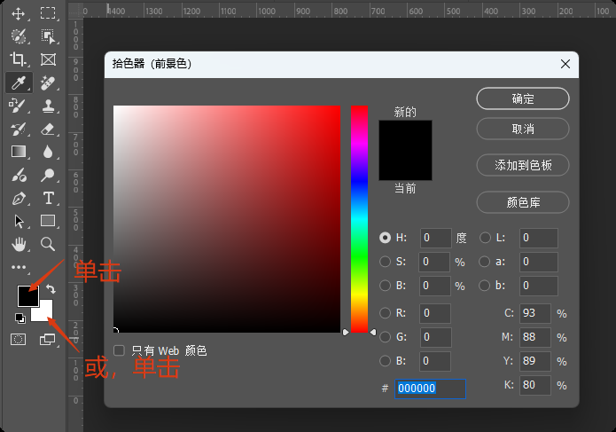
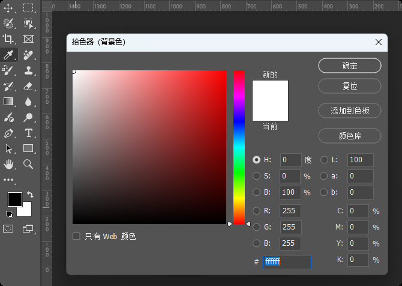
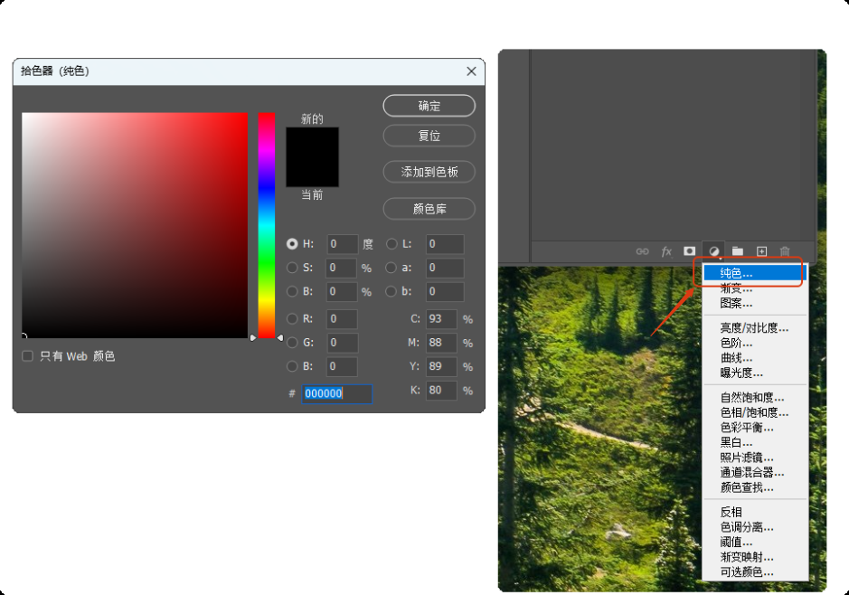

+++
title = "填充"
date = 2025-10-07T17:12:49+08:00
weight = 0
type = "docs"
description = ""
isCJKLanguage = true
draft = false

+++

## 理解拾色器和色板

> `X键`：切换前景色和背景色
>
> `D键`：重置前景色和背景色

### 色相（H）

颜色的相貌

### 饱和度（S）

颜色的鲜艳程度

### 明度（B）

色彩的明暗程度

## 如何给画布填充颜色

## 如何填充局部颜色

