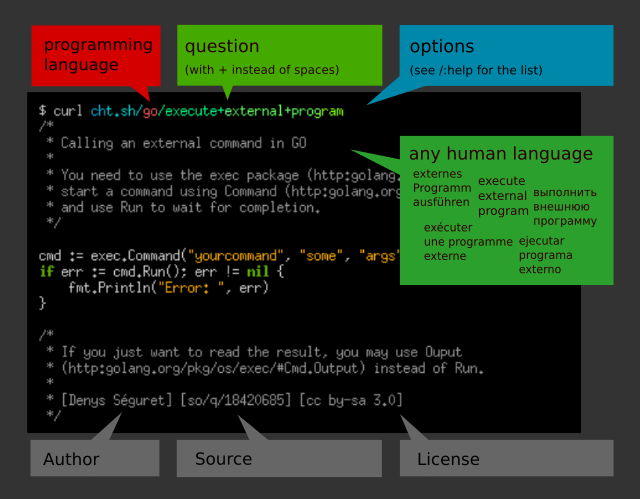
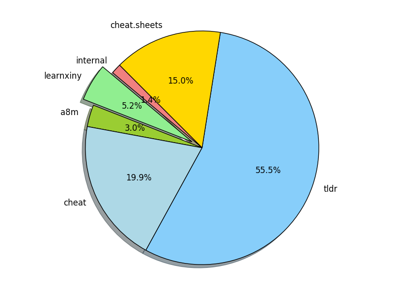

+++
title = "cheat.sh README"
date = 2024-10-10T20:03:04+08:00
weight = 0
type = "docs"
description = ""
isCJKLanguage = true
draft = false

+++

> 原文：[https://github.com/chubin/cheat.sh/blob/master/README.md](https://github.com/chubin/cheat.sh/blob/master/README.md)


Unified access to the best community driven cheat sheets repositories of the world.

​	统一访问世界上最优秀的社区驱动速查表库。

Let's imagine for a moment that there is such a thing as an ideal cheat sheet. What should it look like? What features should it have?

​	让我们设想一下理想的速查表应该是什么样子的？它应该具备哪些特征？

- **Concise** — It should only contain the things you need, and nothing else.
- **简明** — 只包含你需要的内容，别无其他。

- **Fast** — It should be possible to use it instantly.
- **快速** — 应该能够立即使用。
- **Comprehensive** — It should contain answers for every possible question.
- **全面** — 能回答所有可能的问题。
- **Universal** — It should be available everywhere, anytime, without any preparations.
- **通用** — 应该随时随地都能访问，不需要任何准备。
- **Unobtrusive** — It should not distract you from your main task.
- **不打扰** — 不应干扰你正在做的主要任务。
- **Tutoring** — It should help you to learn the subject.
- **教学** — 应该帮助你学习该主题。
- **Inconspicuous** — It should be possible to use it completely unnoticed.
- **低调** — 应该可以在不引人注意的情况下使用。

Such a thing exists! It's easy to [install](https://github.com/chubin/cheat.sh#installation) and there's even [auto-complete](https://github.com/chubin/cheat.sh#tab-completion).

​	这样的工具是存在的！而且安装很简单，甚至还支持[自动补全](https://github.com/chubin/cheat.sh#tab-completion)。

## 特性 Features


**cheat.sh**

- Has a simple curl/browser/editor interface.
- 提供简单的 curl/浏览器/编辑器接口。
- Covers 56 programming languages, several DBMSes, and more than 1000 most important UNIX/Linux commands.
- 涵盖56种编程语言、多个数据库管理系统（DBMS），以及超过1000个最重要的 UNIX/Linux 命令。
- Provides access to the best community driven cheat sheets repositories in the world, on par with StackOverflow.
- 提供全球最好的社区驱动速查表库的访问，类似 StackOverflow 的水准。
- Available everywhere, no installation needed, but can be installed for offline usage.
- 随时随地可用，不需要安装，但也支持离线使用。
- Ultrafast, returns answers within 100 ms, as a rule.
- 响应速度极快，通常在100毫秒内返回答案。
- Has a convenient command line client, `cht.sh`, that is very advantageous and helpful, though not mandatory.
- 拥有便捷的命令行客户端 `cht.sh`，虽然不是必须的，但它提供了许多有用的功能。
- Can be used directly from code editors, without opening a browser and not switching your mental context.
- 可以直接从代码编辑器中使用，无需打开浏览器，也不用切换思维模式。
- Supports a special stealth mode where it can be used fully invisibly without ever touching a key and making sounds.
- 支持特殊的隐身模式，用户可以完全在不引人注意的情况下使用它。

[](https://camo.githubusercontent.com/613161d6a01f384b1ad7b7d7cc153963cb27e151a551f17da612b3c2236c540a/733a2f2f63686561742e73682f66696c65732f64656d6f2d6375726c2e676966)

## 用法 Usage


To get a cheat sheet for a UNIX/Linux command from a command line, query the service using `curl` or any other HTTP/HTTPS client specifying the name of the command in the query:

​	要在命令行中获取 UNIX/Linux 命令的速查表，可以使用 `curl` 或其他 HTTP/HTTPS 客户端来查询服务，并指定所需命令的名称：

```
    curl cheat.sh/tar
    curl cht.sh/curl
    curl https://cheat.sh/rsync
    curl https://cht.sh/tr
```


As you can see, you can use both HTTPS and HTTP to access the service, and both the long (cheat.sh) and the short (cht.sh) service names.

​	如上所示，你可以使用 HTTPS 或 HTTP 访问服务，且可以使用完整的（cheat.sh）或简短的（cht.sh）服务名。

Here `tar`, `curl`, `rsync`, and `tr` are names of the UNIX/Linux commands you want to get cheat sheets for.

​	这里的 `tar`、`curl`、`rsync` 和 `tr` 是你想获取速查表的 UNIX/Linux 命令名称。

If you don't know the name of the command you need, you can search for it using the `~KEYWORD` notation. For example, to see how you can make `snapshots` of a filesystem/volume/something else:

​	如果你不知道所需命令的名称，可以使用 `~KEYWORD` 语法进行搜索。例如，要查看如何对文件系统/卷/其他内容创建 "快照"：

```
    curl cht.sh/~snapshot
```


[](https://camo.githubusercontent.com/fc50801d7fae059bdc278a73e65f6c5c4f84656ff2b3f43acfb6fb91bf4e38b5/733a2f2f63686561742e73682f66696c65732f6368742e73682d75726c2d7374727563747572652e706e67)

The programming language cheat sheets are located in special namespaces dedicated to them.

​	编程语言的速查表位于它们的专属命名空间中，例如：

```
    curl cht.sh/go/Pointers
    curl cht.sh/scala/Functions
    curl cht.sh/python/lambda
```


To get the list of available programming language cheat sheets, use the special query `:list`:

​	要获取某种编程语言的可用速查表列表，使用以下特殊查询 `:list`：

```
    curl cht.sh/go/:list
```


Almost each programming language has a special page named `:learn` that describes the language basics (that's a direct mapping from the *"Learn X in Y"* project). It could be a good starting point if you've just started learning a language.

​	几乎每种编程语言都有一个名为 `:learn` 的特殊页面，描述了该语言的基础知识，这与 *"Learn X in Y"* 项目直接对应。如果你刚开始学习某种语言，这可以是一个很好的起点。

If there is no cheat sheet for a programming language query (and it is almost always the case), it is generated on the fly, based on available cheat sheets and answers on StackOverflow. Of course, there is no guarantee that the returned cheat sheet will be a 100% hit, but it is almost always exactly what you are looking for.

​	如果对某种编程语言的查询没有现成的速查表（这种情况几乎总是如此），系统会根据现有的速查表和 StackOverflow 上的答案即时生成。当然，不能保证返回的速查表百分之百准确，但几乎总是能够满足你的需求。

Try these (and your own) queries to get the impression of that, what the answers look like:

​	尝试以下（以及你自己的）查询，以了解答案的呈现方式：

```
    curl cht.sh/go/reverse+a+list
    curl cht.sh/python/random+list+elements
    curl cht.sh/js/parse+json
    curl cht.sh/lua/merge+tables
    curl cht.sh/clojure/variadic+function
```


If you don't like an answer for your queries, you can pick another one. For that, repeat the query with an additional parameter `/1`, `/2` etc. appended:

​	如果你对查询的答案不满意，可以选择其他答案。这样做，需要在查询中添加额外的参数 `/1`、`/2` 等：

```
    curl cht.sh/python/random+string
    curl cht.sh/python/random+string/1
    curl cht.sh/python/random+string/2
```


Cheat sheets are formatted as code of the queried programming language (at least we are trying our best to do so) so they can be pasted into a program in this language directly. Text comments, if there are any, are formatted according to the language syntax.

​	速查表按查询的编程语言格式化（至少我们尽力而为），因此可以直接粘贴到该语言的程序中。如果有文本注释，会按照语言的语法进行格式化。

```
    $ curl cht.sh/lua/table+keys
    -- lua: retrieve list of keys in a table

    local keyset={}
    local n=0

    for k,v in pairs(tab) do
      n=n+1
      keyset[n]=k
    end

    --[[
       [ Note that you cannot guarantee any order in keyset. If you want the
       [ keys in sorted order, then sort keyset with table.sort(keyset).
       [ 
       [ [lhf] [so/q/12674345] [cc by-sa 3.0]
       ]]
```


If you don't need text comments in the answer, you can eliminate them using a special option `\?Q`:

​	如果你不需要答案中的文本注释，可以使用特殊选项 `\?Q` 删除它们：

```
    $ curl cht.sh/lua/table+keys\?Q
    local keyset={}
    local n=0

    for k,v in pairs(tab) do
      n=n+1
      keyset[n]=k
    end
```


And if you don't need syntax highlighting, switch it off using `\?T`. You can combine the options together:

​	如果你不需要语法高亮，可以使用 `\?T` 关闭。你可以组合这些选项：

```
    curl cht.sh/go/reverse+a+list\?Q
    curl cht.sh/python/random+list+elements\?Q
    curl cht.sh/js/parse+json\?Q
    curl cht.sh/lua/merge+tables\?QT
    curl cht.sh/clojure/variadic+function\?QT
```


Full list of all options described below and in `/:help`.

​	以下是所有选项的完整列表，详见 `/:help`。

Try your own queries. Follow these rules:

​	尝试您自己的查询。遵循这些规则：

1. Try to be more specific (`/python/append+file` is better than `/python/file` and `/python/append`). 尽量具体（比如 `/python/append+file` 比 `/python/file` 和 `/python/append` 更好）。
2. Ask practical question if possible (yet theoretical question are possible too). 尽可能提出实用问题（理论问题也可行）。
3. Ask programming language questions only; specify the name of the programming language as the section name. 仅提出编程语言相关的问题；并将编程语言名称指定为部分名称。
4. Separate words with `+` instead of spaces. 用 `+` 而不是空格分隔单词。
5. Do not use special characters, they are ignored anyway. 不要使用特殊字符，它们反正会被忽略。
6. If you want to eliminate cheat sheets containing some word, add it to the query with `+-`: `python/multiply+matrices+-numpy` 如果您想排除包含某些词的速查表，请在查询中添加 `+-`：`python/multiply+matrices+-numpy`。

Read more about the programming languages queries below.

​	请阅读以下关于编程语言查询的详细信息。

------

## 命令行客户端，cht.sh - Command line client, cht.sh


The cheat.sh service has its own command line client (`cht.sh`) that has several useful features compared to querying the service directly with `curl`:

​	cheat.sh 服务有自己的命令行客户端（`cht.sh`），与直接使用 `curl` 查询服务相比，它具有几个有用的功能：

- Special shell mode with a persistent queries context and readline support. 特殊的 shell 模式，具有持久的查询上下文和 readline 支持。

- Queries history. 查询历史。
- Clipboard integration. 剪贴板集成。
- Tab completion support for shells (bash, fish, zsh).  - shell（bash，fish，zsh）的标签完成支持。
- Stealth mode.  隐身模式。

### 安装 Installation


To install the client:

​	安装客户端的步骤如下：

```
PATH_DIR="$HOME/bin"  # or another directory on your $PATH
mkdir -p "$PATH_DIR"
curl https://cht.sh/:cht.sh > "$PATH_DIR/cht.sh"
chmod +x "$PATH_DIR/cht.sh"
```


or to install it globally (for all users):

​	或者为所有用户全局安装：

```
curl -s https://cht.sh/:cht.sh | sudo tee /usr/local/bin/cht.sh && sudo chmod +x /usr/local/bin/cht.sh
```


Note: The package "rlwrap" is a required dependency to run in shell mode. Install this using `sudo apt install rlwrap`

​	注意：包 "rlwrap" 是在 shell 模式下运行所必需的依赖项。使用 `sudo apt install rlwrap` 安装此包。

### 客户端用法 Client usage


Now, you can use `cht.sh` instead of `curl`, and write your queries in more natural way, with spaces instead of `+`:

​	现在，您可以使用 `cht.sh` 代替 `curl`，并以更自然的方式编写查询，使用空格而不是 `+`：

```
    $ cht.sh go reverse a list
    $ cht.sh python random list elements
    $ cht.sh js parse json
```


It is even more convenient to start the client in a special shell mode:

​	在特殊的 shell 模式下启动客户端更为方便：

```
    $ cht.sh --shell
    cht.sh> go reverse a list
```


If all your queries are about the same language, you can change the context and spare repeating the programming language name:

​	如果您的所有查询都与同一种语言相关，您可以更改上下文，并省去重复编程语言名称：

```
    $ cht.sh --shell
    cht.sh> cd go
    cht.sh/go> reverse a list
```


or even start the client in this context:

​	甚至可以在此上下文中启动客户端：

```
    $ cht.sh --shell go
    cht.sh/go> reverse a list
    ...
    cht.sh/go> join a list
    ...
```


If you want to change the context, you can do it with the `cd` command, or if you want do a single query for some other language, just prepend it with `/`:

​	如果您想更改上下文，可以使用 `cd` 命令，或者如果您想为某个其他语言做单个查询，只需在其前面加上 `/`：

```
    $ cht.sh --shell go
    ...
    cht.sh/go> /python dictionary comprehension
    ...
```


If you want to copy the last answer into the clipboard, you can use the `c` (`copy`) command, or `C` (`ccopy`, without comments).

​	如果您想将最后的答案复制到剪贴板，您可以使用 `c`（copy）命令，或 `C`（ccopy，无注释）。

```
    cht.sh/python> append file
    #  python - How do you append to a file?

    with open("test.txt", "a") as myfile:
        myfile.write("appended text")
    cht.sh/python> C
    copy: 2 lines copied to the selection
```


Type `help` for other internal `cht.sh` commands.

​	输入 `help` 获取其他内部 `cht.sh` 命令。

```
	cht.sh> help
	help    - show this help
	hush    - do not show the 'help' string at start anymore
	cd LANG - change the language context
	copy    - copy the last answer in the clipboard (aliases: yank, y, c)
	ccopy   - copy the last answer w/o comments (cut comments; aliases: cc, Y, C)
	exit    - exit the cheat shell (aliases: quit, ^D)
	id [ID] - set/show an unique session id ("reset" to reset, "remove" to remove)
	stealth - stealth mode (automatic queries for selected text)
	update  - self update (only if the scriptfile is writeable)
	version - show current cht.sh version
	/:help  - service help
	QUERY   - space separated query staring (examples are below)
				  cht.sh> python zip list
				  cht.sh/python> zip list
				  cht.sh/go> /python zip list
```


The `cht.sh` client has its configuration file which is located at `~/.cht.sh/cht.sh.conf` (location of the file can be overridden by the environment variable `CHTSH_CONF`). Use it to specify query options that you would use with each query. For example, to switch syntax highlighting off create the file with the following content:

​	`cht.sh` 客户端拥有其配置文件，位于 `~/.cht.sh/cht.sh.conf`（该文件的位置可以通过环境变量 `CHTSH_CONF` 覆盖）。使用它来指定每次查询时将使用的查询选项。例如，要关闭语法高亮，请创建带有以下内容的文件：

```conf
CHTSH_QUERY_OPTIONS="T"
```


Or if you want to use a special syntax highlighting theme:

​	如果您想使用特殊的语法高亮主题：

```conf
CHTSH_QUERY_OPTIONS="style=native"
```


(`curl cht.sh/:styles-demo` to see all supported styles).

​	（使用 `curl cht.sh/:styles-demo` 查看所有支持的样式。）

Other cht.sh configuration parameters:

​	其他 `cht.sh` 配置参数：

```conf
CHTSH_CURL_OPTIONS="-A curl"        # curl options used for cht.sh queries - curl 选项用于 cht.sh 查询
CHTSH_URL=https://cht.sh            # URL of the cheat.sh server - cheat.sh 服务器的 URL
```


### 标签补全 Tab completion


#### Bash 标签补全 Bash Tab completion


To activate tab completion support for `cht.sh`, add the `:bash_completion` script to your `~/.bashrc`:

​	要为 `cht.sh` 激活标签补全支持，请将 `:bash_completion` 脚本添加到您的 `~/.bashrc`：

```
    curl https://cheat.sh/:bash_completion > ~/.bash.d/cht.sh
    . ~/.bash.d/cht.sh
    # and add . ~/.bash.d/cht.sh to ~/.bashrc 并将 . ~/.bash.d/cht.sh 添加到 ~/.bashrc
```


#### ZSH 标签补全 ZSH Tab completion


To activate tab completion support for `cht.sh`, add the `:zsh` script to the *fpath* in your `~/.zshrc`:

​	要为 `cht.sh` 激活 ZSH 标签补全支持，请将 `:zsh` 脚本添加到您的 `~/.zshrc` 中的 *fpath*：

```
    curl https://cheat.sh/:zsh > ~/.zsh.d/_cht
    echo 'fpath=(~/.zsh.d/ $fpath)' >> ~/.zshrc
    # Open a new shell to load the plugin
    # 打开一个新的 shell 来加载插件
```


------

### 隐身模式 Stealth mode


Being used fully unnoticed is one of the most important property of any cheat sheet.

​	隐身模式是任何速查表最重要的特性之一。

cheat.sh can be used completely unnoticed too. The cheat.sh client, `cht.sh`, has a special mode, called **stealth mode**. Using that, you don't even need to touch your keyboard to open a cheat sheet.

​	`cht.sh` 也可以完全不被注意地使用。`cht.sh` 客户端有一个特殊模式，称为 **隐身模式**。使用这种模式，您甚至不需要触摸键盘就可以打开速查表。

In this mode, as soon as you select some text with the mouse (and thus adding it into the selection buffer of X Window System or into the clipboard) it's used as a query string for cheat.sh, and the correspondent cheat sheet is automatically shown.

​	在这种模式下，只要您用鼠标选择了一些文本（从而将其添加到 X Window System 的选择缓冲区或剪贴板中），它就会作为查询字符串用于 `cheat.sh`，并自动显示相应的速查表。

Let's imagine, that you are having an online interview, where your interviewer asks you some questions using a shared document (say Google Docs) and you are supposed to write your coding answers there (it's possible too that you'll type in the questions on your own, just to show to the interviewer that you've heard it right).

​	想象一下，您正在进行一个在线面试，面试官使用共享文档（比如 Google Docs）向您提问，您需要在那里写下您的编程答案（您也可能需要自己输入问题，只是为了向面试官展示您已经听明白了）。

When using the stealth mode of `cht.sh`, the only thing you need to do in order to see a cheat sheet for some question, is to select the question using the mouse. If you don't want any text in the answers and the only thing you need is code, use the `Q` option when starting the stealth mode.

​	使用 `cht.sh` 的隐身模式时，您唯一需要做的，就是用鼠标选择问题。如果您不希望答案中有任何文本，只需要代码，可以在启动隐身模式时使用 `Q` 选项。

[](https://camo.githubusercontent.com/95789cc483dbe4f4198a81714580a410ddb5efa1d0909c2ece1ecbb589cd5e5c/733a2f2f63686561742e73682f66696c65732f737465616c74682d6d6f64652e676966)

```
You: Hi!                                            | $ cht.sh --shell python
She: Hi!                                            | cht.sh/python> stealth Q
She: Are you ready for a small interview?           | stealth: you are in the stealth mode; select any text
She: Just a couple of questions                     | stealth: selections longer than 5 words are ignored
She: We will talk about python                      | stealth: query arguments: ?Q
She: Let's start from something simple.             | stealth: use ^C to leave this mode
She: Do you know how to reverse a list in python?   |
You: Sure                                           |
You: (selecting "reverse a list")                   | stealth: reverse a list
                                                    | reverse_lst = lst[::-1]
You: lst[::-1]?                                     |
She: Good.                                          |
She: Do you know how to chain a list of lists?      |
You: (selecting "chain a list of lists")            | stealth: chain a list of lists
                                                    | import itertools
                                                    | a = [["a","b"], ["c"]]
                                                    | print list(itertools.chain.from_iterable(a))
You: May I use external modules?                    |
She: What module do you want to use?                |
You: itertools                                      |
She: Yes, you may use it                            |
You: Ok, then:                                      |
You: itertools.chain.from_iterable(a)               |
She: Good. Let's try something harder.              |
She: What about quicksort implementation?           |
You: (selecting "quicksort implementation")         | stealth: quicksort implementation
You: Let me think about it.                         | (some big and clumsy lowlevel implementation shown)
You: Well...(starting typing it in)                 | def sort(array=[12,4,5,6,7,3,1,15]):
                                                    |     less = []
She: (seeing your ugly pascal style)                |     equal = []
She: Could you write it more concise?               |     greater = []
                                                    |     if len(array) > 1:
You: What do you mean?                              |         pivot = array[0]
                                                    |         for x in array:
She: I mean,                                        |             if x < pivot: less.append(x)
She: do you really need all these ifs and fors?     |             if x == pivot: equal.append(x)
She: Could you maybe just use filter instead?       |             if x > pivot: greater.append(x)
                                                    |         return sort(less)+equal+sort(greater)
You: quicksort with filter?                         |     else:
                                                    |         return array
She: Yes                                            |
You: (selecting "quicksort with filter")            | stealth: quicksort with filter
You: Ok, I will try.                                | return qsort(filter(lt, L[1:]))+[pivot] \
You: Something like this?                           |     +qsort(filter(ge, L[1:]))
You: qsort(filter(lt, L[1:]))+[pivot] \             |
       + qsort(filter(ge, L[1:]))                   |
                                                    |
She: Yes! Perfect! Exactly what I wanted to see!    |
                                                    |
```


Of course, this is just for fun, and you should never cheat in your coding interviews, because you know what happens when you do.

​	当然，这只是为了好玩，你永远不应该在编程面试中作弊，因为你知道那样做会发生什么。

[](https://camo.githubusercontent.com/22542789fb16089c6f837f438c191019a0375c9d4fd0a4e248c87406e8475f20/3a2f2f63686561742e73682f66696c65732f7768656e2d796f752d6c69652d6b61747a652e706e67)

### Windows 命令行客户端 Windows command line client


You can access cheat.sh from Windows command line too.

​	你也可以通过 Windows 命令行访问 cheat.sh。

Use cheat.sh command line client for that: [`cht.exe`](https://github.com/tpanj/cht.exe). It supports:

​	使用 cheat.sh 的命令行客户端：[`cht.exe`](https://github.com/tpanj/cht.exe)。它支持：

- output colorization; 输出彩色化；

- command line options; 命令行选项；
- its own configuration file. 自己的配置文件。

You can also use [`scoop`](https://github.com/lukesampson/scoop) command-line installer for Windows to get it:

​	你还可以使用 [`scoop`](https://github.com/lukesampson/scoop) 命令行安装器来安装它：

```
scoop install cht
```


------

## 自托管 Self-Hosting


### Docker


Currently, the easiest way to get a self-hosted instance running is by using the `docker-compose.yml` file.

​	目前，使用 `docker-compose.yml` 文件是启动自托管实例最简单的方法。

```
docker-compose up
```


This builds and runs the image with baked in cheatsheets and starts the app and a Redis instance to back it, making the service available at [http://localhost:8002](http://localhost:8002/) This is currently an early implementation and should probably not be used for anything outside of internal/dev/personal use right now.

​	这将构建并运行内置速查表的镜像，并启动应用程序和一个 Redis 实例作为其后端，使服务在 [http://localhost:8002](http://localhost:8002/) 可用。目前这仍是一个早期实现，可能不适合用于除内部/开发/个人使用之外的其他用途。

## 编辑器集成 Editors integration


You can use *cheat.sh* directly from the editor (*Emacs*, *Sublime*, *Vim*, and *Visual Studio Code* are currently supported; not all features are supported by all plugins though; see below). Instead of opening your browser, googling, browsing Stack Overflow and eventually copying the code snippets you need into the clipboard and later pasting them into the editor, you can achieve the same instantly and without leaving the editor at all!

​	你可以直接从编辑器中使用 *cheat.sh*（目前支持 *Emacs*、*Sublime*、*Vim* 和 *Visual Studio Code*；不过，并非所有插件都支持所有功能，详见下文）。你无需打开浏览器，无需谷歌搜索，无需浏览 Stack Overflow，再将你需要的代码片段复制到剪贴板，然后粘贴到编辑器中，你可以立即完成这一切，而无需离开编辑器。

Here is what it looks like in Vim:

​	这是在 Vim 中的样子：

1. If you have a question while editing a program, you can just type your question directly in the buffer and press `<leader>KK`. You will get the answer to your question in pager. (with `<leader>KB` you'll get the answer in a separate buffer). 如果你在编辑程序时有疑问，只需直接在缓冲区中键入你的问题，然后按 `<leader>KK`。你将在分页器中得到问题的答案。（使用 `<leader>KB`，你将在一个单独的缓冲区中得到答案。）
2. If you like the answer, you can manually paste it from the buffer or the pager, or if you are lazy you can use `<leader>KP` to paste it below/under your question (or replace you question using `<leader>KR`). If you want the answer without the comments, `<leader>KC` replays the last query toggling them. 如果你喜欢这个答案，你可以手动从缓冲区或分页器中粘贴它，或者如果你懒得这样做，你可以使用 `<leader>KP` 将其粘贴在你的问题下面/下方（或使用 `<leader>KR` 替换你的问题）。如果你想要没有注释的答案，`<leader>KC` 可以重放最后的查询并切换它们。

If you use some static analysis plugin such as *syntastic* (for Vim), you can use its warning and error messages as cheat.sh queries: place the cursor on the problem line and press `<leader>KE`: explanation for the warning will be opened in a new buffer.

​	如果你使用如 *syntastic*（对于 Vim）之类的静态分析插件，你可以使用其警告和错误消息作为 cheat.sh 查询：将光标放在问题行上，然后按 `<leader>KE`：警告的解释将在新缓冲区中打开。

Features supported by cheat.sh plugins for different editors:

​	不同编辑器的 cheat.sh 插件支持的功能：

| Feature             | Emacs | Sublime | Vim  | VSCode | IDEA | QtCreator |
| ------------------- | ----- | ------- | ---- | ------ | ---- | --------- |
| Command queries     | ✓     | ✓       | ✓    | ✓      | ✓    | ✓         |
| Queries from buffer |       |         | ✓    | ✓      |      | ✓         |
| Toggle comments     |       |         | ✓    | ✓      | ✓    | ✓         |
| Prev/next answer    |       |         | ✓    | ✓      | ✓    | ✓         |
| Multiple answers    |       | ✓       |      |        | ✓    |           |
| Warnings as queries |       |         | ✓    |        |      |           |
| Queries history     |       |         | ✓    | ✓      |      |           |
| Session id          |       |         | ✓    |        |      |           |
| Configurable server | ✓     |         | ✓    | ✓      |      | ✓         |

### Vim


- [cheat.sh-vim](https://github.com/dbeniamine/cheat.sh-vim) — Vim support

Here is Vim configuration example:

​	这里是 Vim 配置示例：

```
" some configuration above ...

let mapleader=" "

call vundle#begin()
Bundle 'gmarik/vundle'
Bundle 'scrooloose/syntastic'
Bundle 'dbeniamine/cheat.sh-vim'
call vundle#end()

let g:syntastic_javascript_checkers = [ 'jshint' ]
let g:syntastic_ocaml_checkers = ['merlin']
let g:syntastic_python_checkers = ['pylint']
let g:syntastic_shell_checkers = ['shellcheck']

" some configuration below ...
```


In this example, several Vim plugins are used:

​	在这个示例中，使用了几个 Vim 插件：

- [gmarik/vundle](https://github.com/VundleVim/Vundle.vim) — Vim plugin manager - Vim 插件管理器

- [scrooloose/syntastic](https://github.com/vim-syntastic/syntastic) — Syntax checking plugin - 语法检查插件
- [cheat.sh-vim](https://github.com/dbeniamine/cheat.sh-vim) — Vim support - Vim 支持

Syntastic shows warnings and errors (found by code analysis tools: `jshint`, `merlin`, `pylint`, `shellcheck` etc.), and `cheat.sh-vim` shows you explanations for the errors and warnings and answers on programming languages queries written in the editor.

​	Syntastic 会显示警告和错误（通过代码分析工具找到：`jshint`、`merlin`、`pylint`、`shellcheck` 等），而 `cheat.sh-vim` 会在编辑器中显示这些错误和警告的解释以及编程语言查询的答案。

Watch a demo, where the most important features of the cheat.sh Vim plugin are shown (5 Min):

​	观看一个演示视频，展示了 cheat.sh Vim 插件的最重要功能（时长 5 分钟）：

[](https://camo.githubusercontent.com/fcfe136eadd4c0093f60904e59470de0b0212aa6fc92274cc76d7017e00fc227/733a2f2f63686561742e73682f66696c65732f76696d2d64656d6f2e676966)

Or, if you want to scroll and/or pause, the same on YouTube:

​	如果你想滚动或暂停，同样的内容也在 YouTube 上：

[](http://www.youtube.com/watch?feature=player_embedded&v=xyf6MJ0y-z8)

### Emacs


- [cheat-sh.el](https://github.com/davep/cheat-sh.el) — Emacs support (available also at cheat.sh/:emacs) - Emacs 支持（也可在 cheat.sh/

  中找到）
- cheat.sh/:emacs-ivy — Emacs support for ivy users - 针对 ivy 用户的 Emacs 支持

[](https://asciinema.org/a/3xvqwrsu9g4taj5w526sb2t35)

### Visual Studio Code


- [vscode-snippet](https://github.com/mre/vscode-snippet)
- Install it from [VSCode Marketplace](https://marketplace.visualstudio.com/items?itemName=vscode-snippet.Snippet)

Usage:

​	用法：

1. Hit ⌘ Command + ⇧ Shift + p
2. Run `Snippet: Find`.
3. Type your query and hit enter. 输入你的查询并按回车。

[](https://github.com/mre/vscode-snippet)

*(GIF courtesy: Matthias Endler, @mre)*

### Sublime


- [cheat.sh-sublime-plugin](https://github.com/gauravk-in/cheat.sh-sublime-plugin/)

Usage:

​	用法：

1. Write your query string. 编写你的查询字符串。
2. Select the query string. 选择查询字符串。
3. Press Cmd + ⇧ Shift + B to replace the selected query string by the answer generated from `cht.sh`. 按 Cmd + ⇧ Shift + B 将选中的查询字符串替换为从 `cht.sh` 生成的答案。

[](https://github.com/gauravk-in/cheat.sh-sublime-plugin)

*(GIF courtesy: Gaurav Kukreja, @gauravk-in)*

### IntelliJ IDEA


- [idea-cheatsh-plugin](https://github.com/szymonprz/idea-cheatsh-plugin)
- Install from [idea plugins marketplace](https://plugins.jetbrains.com/plugin/11942-cheat-sh-code-snippets)

Usage:

​	用法：

1. Write query string 编写查询字符串
2. Select the query string 选择查询字符串
3. Press keyboard shortcut Alt + C , S to replace the selected query string by the answer 按键盘快捷键 Alt + C , S 将选中的查询字符串替换为答案

[](https://github.com/szymonprz/idea-cheatsh-plugin)

*(GIF courtesy: Szymon Przebierowski, @szymonprz)*

### QtCreator


- [cheatsh-qtcreator](https://github.com/pozemka/cheatsh-qtcreator)

Current features:

​	当前功能：

- search word under cursor 在光标下搜索单词
- search selected 搜索选中内容
- query search 查询搜索
- disable comments 禁用注释
- paste answer (?TQ version) 粘贴答案 (?TQ 版本)
- custom server URL 自定义服务器 URL
- custom search context (default is cpp) 自定义搜索上下文（默认为 cpp）
- hotkeys and menu 快捷键和菜单

[](https://github.com/pozemka/cheatsh-qtcreator)

*(GIF courtesy: Pozemka, @pozemka)*

## 特殊页面 Special pages


There are several special pages that are not cheat sheets. Their names start with colon and have special meaning.

​	这些特殊页面不是速查表。它们的名称以冒号开始，并具有特殊含义。

Getting started:

​	入门：

```
    :help               description of all special pages and options 所有特殊页面和选项的描述
    :intro              cheat.sh introduction, covering the most important usage questions cheat.sh 介绍，涵盖最重要的使用问题
    :list               list all cheat sheets (can be used in a subsection too: /go/:list) 列出所有速查表（也可在子部分中使用：/go/:list）
```


Command line client `cht.sh` and shells support:

​	命令行客户端 `cht.sh` 和 shell 支持：

```
    :cht.sh             code of the cht.sh client - cht.sh 客户端的代码
    :bash_completion    bash function for tab completion - bash 的 tab 补全功能
    :bash               bash function and tab completion setup - bash 函数和 tab 补全设置
    :fish               fish function and tab completion setup - fish 函数和 tab 补全设置
    :zsh                zsh function and tab completion setup - zsh 函数和 tab 补全设置
```


Editors support:

​	编辑器支持：

```
    :vim                cheat.sh support for Vim - Vim 的 cheat.sh 支持
    :emacs              cheat.sh function for Emacs - Emacs 的 cheat.sh 函数
    :emacs-ivy          cheat.sh function for Emacs (uses ivy) - Emacs 的 cheat.sh 函数（使用 ivy）
```


Other pages:

```
    :post               how to post new cheat sheet 如何发布新的速查表
    :styles             list of color styles 颜色样式列表
    :styles-demo        show color styles usage examples 显示颜色样式使用示例
    :random             fetches a random page (can be used in a subsection too: /go/:random) 获取随机页面（也可在子部分中使用：/go/:random）
```


## 搜索 Search


To search for a keyword, use the query:

​	要搜索关键词，使用查询：

```
    /~keyword
```


In this case search is not recursive — it is conducted only in a page of the specified level. For example:

​	在这种情况下，搜索不是递归的 —— 它仅在指定级别的页面中进行。例如：

```
    /~snapshot          look for snapshot in the first level cheat sheets 在第一级速查表中搜索 snapshot
    /scala/~currying     look for currying in scala cheat sheets 在 scala 速查表中搜索 currying
```


For a recursive search in all cheat sheets, use double slash:

​	要在所有速查表中进行递归搜索，请使用双斜杠：

```
    /~snapshot/r         look for snapshot in all cheat sheets 在所有速查表中搜索 snapshot
```


You can use special search options after the closing slash:

​	在关闭斜杠后，您可以使用特殊搜索选项：

```
    /~shot/bi           case insensitive (i), word boundaries (b) - 不区分大小写 (i)，单词边界 (b)
```


List of search options:

​	搜索选项列表：

```
    i   case insensitive search 不区分大小写搜索
    b   word boundaries 单词边界
    r   recursive search 递归搜索
```


## 编程语言速查表 Programming languages cheat sheets


Cheat sheets related to programming languages are organized in namespaces (subdirectories), that are named according to the programming language.

​	与编程语言相关的速查表按名称空间（子目录）组织，按编程语言命名。

For each supported programming language there are several special cheat sheets: its own sheet, `hello`, `:list` and `:learn`. Say for lua it will look like:

​	每种受支持的编程语言都有几个特殊的速查表：它自己的速查表、`hello`、`:list` 和 `:learn`。例如 lua 将如下所示：

```
    lua
    lua/hello
    lua/:list
    lua/:learn
```


Some languages has the one-liners-cheat sheet, `1line`:

​	一些语言有单行代码速查表，`1line`：

```
    perl/1line
```


- `hello` describes how you can start with the language — install it if needed, build and run its programs, and it shows the "Hello world" program written in the language; `hello` 描述如何开始使用该语言 —— 如有需要，安装它，构建和运行其程序，并显示用该语言编写的“Hello world”程序；
- `:list` shows all topics related to the language `:list` 显示与该语言相关的所有主题
- `:learn` shows a learn-x-in-minutes language cheat sheet perfect for getting started with the language. `:learn` 显示一个学习 x 分钟的语言速查表，非常适合开始学习该语言。
- `1line` is a collection of one-liners in this language `1line` 是这种语言中单行代码的集合
- `weirdness` is a collection of examples of weird things in this language `weirdness` 是这种语言中奇怪事物的示例集合

[](https://camo.githubusercontent.com/d992aa0f1206418fa5573c774d8010a55a52f8aa22661658b22cc6df89ccab15/3a2f2f63686561742e73682f66696c65732f737570706f727465642d6c616e6775616765732d632b2b2e706e67)

At the moment, cheat.sh covers the 58 following programming languages (alphabetically sorted):

​	目前，cheat.sh 涵盖以下 58 种编程语言（按字母顺序排序）：

| Prefix         | Language     | Basics | One-liners | Weirdness | StackOverflow |
| -------------- | ------------ | ------ | ---------- | --------- | ------------- |
| `arduino/`     | Arduino      |        |            |           | ✓             |
| `assembly/`    | Assembly     |        |            |           | ✓             |
| `awk/`         | AWK          | ✓      |            |           | ✓             |
| `bash/`        | Bash         | ✓      |            |           | ✓             |
| `basic/`       | BASIC        |        |            |           | ✓             |
| `bf/`          | Brainfuck    | ✓      |            |           | ✓             |
| `c/`           | C            | ✓      |            |           | ✓             |
| `chapel/`      | Chapel       | ✓      |            |           | ✓             |
| `clean/`       | Clean        |        |            |           | ✓             |
| `clojure/`     | Clojure      | ✓      |            |           | ✓             |
| `coffee/`      | CoffeeScript | ✓      |            |           | ✓             |
| `cpp/`         | C++          | ✓      |            |           | ✓             |
| `csharp/`      | C#           | ✓      |            |           | ✓             |
| `d/`           | D            | ✓      |            |           | ✓             |
| `dart/`        | Dart         | ✓      |            |           | ✓             |
| `delphi/`      | Dephi        |        |            |           | ✓             |
| `dylan/`       | Dylan        | ✓      |            |           | ✓             |
| `eiffel/`      | Eiffel       |        |            |           | ✓             |
| `elixir/`      | Elixir       | ✓      |            |           | ✓             |
| `elisp/`       | ELisp        | ✓      |            |           | ✓             |
| `elm/`         | Elm          | ✓      |            |           | ✓             |
| `erlang/`      | Erlang       | ✓      |            |           | ✓             |
| `factor/`      | Factor       | ✓      |            |           | ✓             |
| `fortran/`     | Fortran      | ✓      |            |           | ✓             |
| `forth/`       | Forth        | ✓      |            |           | ✓             |
| `fsharp/`      | F#           | ✓      |            |           | ✓             |
| `go/`          | Go           | ✓      |            |           | ✓             |
| `groovy/`      | Groovy       | ✓      |            |           | ✓             |
| `haskell/`     | Haskell      | ✓      |            |           | ✓             |
| `java/`        | Java         | ✓      |            |           | ✓             |
| `js/`          | JavaScript   | ✓      | ✓          | ✓         | ✓             |
| `julia/`       | Julia        | ✓      |            |           | ✓             |
| `kotlin/`      | Kotlin       | ✓      |            |           | ✓             |
| `latex/`       | LaTeX        | ✓      |            |           | ✓             |
| `lisp/`        | Lisp         | ✓      |            |           | ✓             |
| `lua/`         | Lua          | ✓      |            |           | ✓             |
| `matlab/`      | MATLAB       | ✓      |            |           | ✓             |
| `nim/`         | Nim          | ✓      |            |           | ✓             |
| `ocaml/`       | OCaml        | ✓      |            |           | ✓             |
| `octave/`      | Octave       | ✓      |            |           | ✓             |
| `perl/`        | Perl         | ✓      | ✓          |           | ✓             |
| `perl6/`       | Perl 6       | ✓      | ✓          |           | ✓             |
| `php/`         | PHP          | ✓      |            |           | ✓             |
| `pike/`        | Pike         |        |            |           | ✓             |
| `python/`      | Python       | ✓      | ✓          |           | ✓             |
| `python3/`     | Python 3     | ✓      |            |           | ✓             |
| `r/`           | R            | ✓      |            |           | ✓             |
| `racket/`      | Racket       | ✓      |            |           | ✓             |
| `ruby/`        | Ruby         | ✓      |            |           | ✓             |
| `rust/`        | Rust         | ✓      |            |           | ✓             |
| `scala/`       | Scala        | ✓      |            |           | ✓             |
| `scheme/`      | Scheme       | ✓      |            |           | ✓             |
| `solidity/`    | Solidity     | ✓      |            |           | ✓             |
| `swift/`       | Swift        | ✓      |            |           | ✓             |
| `tcsh/`        | Tcsh         | ✓      |            |           | ✓             |
| `tcl/`         | Tcl          | ✓      |            |           | ✓             |
| `objective-c/` | Objective-C  | ✓      |            |           | ✓             |
| `vb/`          | VisualBasic  | ✓      |            |           | ✓             |
| `vbnet/`       | VB.Net       | ✓      |            |           | ✓             |

And several other topics, that are though related to programming, are not programming languages:

​	此外，还有几个主题虽然与编程相关，但并非编程语言：

| Prefix    | Topic  | Basics | StackOverflow |
| --------- | ------ | ------ | ------------- |
| `cmake/`  | CMake  | ✓      | ✓             |
| `django/` | Django |        | ✓             |
| `flask/`  | Flask  |        | ✓             |
| `git/`    | Git    | ✓      | ✓             |

## 速查表资源 Cheat sheets sources


Instead of creating yet another mediocre cheat sheet repository, we are concentrating our efforts on creation of a unified mechanism to access selected existing well developed and good maintained cheat sheet repositories covering topics of our interest: programming and operating systems usage.

​	我们并未试图创建又一个平庸的速查表库，而是专注于创建一个统一的机制，访问我们感兴趣的主题：编程和操作系统使用的现有、精心开发和维护良好的速查表库。

*cheat.sh* uses selected community driven cheat sheet repositories and information sources, maintained by thousands of users, developers and authors all over the world (in the *Users* column number of contributors/number of stars is shown):

​	*cheat.sh* 使用由全世界数千名用户、开发者和作者维护的精选社区驱动速查表库和信息源（*Users* 列显示了贡献者的数量/星级）：

| Cheat sheets            | Repository                                                   | C/U*                                                         | Stars | Creation Date |
| ----------------------- | ------------------------------------------------------------ | ------------------------------------------------------------ | ----- | ------------- |
| UNIX/Linux, programming | [cheat.sheets](https://github.com/chubin/cheat.sheets)       | [78](https://camo.githubusercontent.com/e55a23c625b9eca360410778f4926fc0179a52f5fd7d5e4401683c90afc47a61/68747470733a2f2f696d672e736869656c64732e696f2f6769746875622f636f6e7472696275746f72732d616e6f6e2f63687562696e2f63686561742e7368656574733f6c6162656c3d254630253946253931254135266c6162656c436f6c6f723d7768697465) | 595   | May 1, 2017   |
| UNIX/Linux commands     | [tldr-pages/tldr](https://github.com/tldr-pages/tldr)        | [2.8k](https://camo.githubusercontent.com/80897257282d1ac090b367c779b1d3e053a39c00f3c69f818760acd69b08a836/68747470733a2f2f696d672e736869656c64732e696f2f6769746875622f636f6e7472696275746f72732d616e6f6e2f746c64722d70616765732f746c64723f6c6162656c3d254630253946253931254135266c6162656c436f6c6f723d7768697465) | 51k   | Dec 8, 2013   |
| UNIX/Linux commands     | [chrisallenlane/cheat](https://github.com/chrisallenlane/cheat) | [173](https://camo.githubusercontent.com/645badc06b9ebde5f487b6d8f25a23a94963d129210b539326ba74aa6bd94234/68747470733a2f2f696d672e736869656c64732e696f2f6769746875622f636f6e7472696275746f72732d616e6f6e2f6368726973616c6c656e6c616e652f63686561743f6c6162656c3d254630253946253931254135266c6162656c436f6c6f723d7768697465) | 73    | Jul 28, 2013  |
| Programming languages   | [adambard/learnxinyminutes-docs](https://github.com/adambard/learnxinyminutes-docs) | 2.1k                                                         | 11k   | Jun 23, 2013  |
| Go                      | [a8m/go-lang-cheat-sheet](https://github.com/a8m/go-lang-cheat-sheet) | 34                                                           | 8.3k  | Feb 9, 2014   |
| Perl                    | [pkrumnis/perl1line.txt](https://github.com/pkrumins/perl1line.txt) | 7                                                            | 246   | Nov 4, 2011   |
| Programming languages   | [StackOverflow](https://stackoverflow.com/)                  | [14M](https://stackexchange.com/leagues/1/alltime/stackoverflow) | N/A   | Sep 15, 2008  |

(*) C/U — contributors for GitHub repositories, Users for Stackoverflow - GitHub 仓库的贡献者，StackOverflow 的用户

Pie diagram reflecting cheat sheets sources distribution (by number of cheat sheets on cheat.sh originating from a repository):

​	反映速查表来源分布的饼图（根据 cheat.sh 源自一个仓库的速查表数量）：

[](https://camo.githubusercontent.com/2d4168f0e7c1fed2094694791fbfe36cc61808ba15d81b295a88080f90c61301/3a2f2f63686561742e73682f66696c65732f737461742d323031372d30362d30352e706e67)

## 如何贡献 How to contribute


### 如何编辑速查表 How to edit a cheat sheet


If you want to edit a cheat.sh cheat sheet, you should edit it in the upstream repository. You will find the name of the source repository in a browser when you open a cheat sheet. There are two github buttons at the bottom of the page: the second one is the button of the repository, which belongs the current cheat sheet.

​	如果你想编辑 *cheat.sh* 的速查表，应该在源仓库进行编辑。当你在浏览器中打开一个速查表时，可以找到源仓库的名称。页面底部有两个 GitHub 按钮：第二个按钮是当前速查表所属的仓库的按钮。

You can edit the cheat sheet directly in your browser (you need a github account for it). There is an edit button in the top right corner. If you click on it, an editor will be open. There you will change the cheat sheet (under the hood: the upstream repository is forked, your changes are committed in the forked repository, a pull request to the upstream repository owner is sent).

​	你可以直接在浏览器中编辑速查表（需要一个 GitHub 账户）。在右上角有一个编辑按钮。点击它后，会打开一个编辑器。在这里你可以修改速查表（幕后操作：源仓库被 fork，你的更改会提交到 fork 的仓库，然后发送一个 pull request 给源仓库的所有者）。

[](https://camo.githubusercontent.com/e18bbd2d9fa04fd602771d34df7c0193835849ebb8fc14ace01ac930eacc2ae9/3a2f2f63686561742e73682f66696c65732f656469742d63686561742d73686565742e706e67)

### 如何添加速查表 How to add a cheat sheet


If you want to add a cheat sheet, you have one of the following ways:

​	如果你想添加一个速查表，你可以选择以下方式之一：

- Add it to one of the external cheat sheets repositories; you should decide on your own what is the best repository for your cheat sheet; 将其添加到外部速查表库；你应自行决定哪个库最适合你的速查表；
- Add it to the local cheat.sh repository ([cheat.sheets](https://github.com/chubin/cheat.sheets)) on github (fork, commit, pull request); 将其添加到 GitHub 上的本地 *cheat.sh* 仓库 ([cheat.sheets](https://github.com/chubin/cheat.sheets))（fork，commit，pull request）；
- Post it on cheat.sh using curl or a web browser ([cheat.sh/:post](http://cheat.sh/:post)). 使用 curl 或网页浏览器在 *cheat.sh* 上发布它（[cheat.sh/:post](http://cheat.sh/:post)）。

If you want to change an existing cheat sheet, you have to find the original repository (when you open a cheat sheet in a browser, you see the repository's github button in the bottom of the cheat sheet), the cheat sheet is coming from, and change it there. After some time the changes will be synchronized on cheat.sh.

​	如果你想更改现有的速查表，你必须找到原始仓库（当你在浏览器打开一个速查表时，你可以看到页面底部的仓库的 GitHub 按钮），并在那里进行更改。一段时间后，更改会在 *cheat.sh* 上同步。

### 如何添加速查表库 How to add a cheat sheet repository


If you want to add a cheat sheet repository to cheat.sh, please open an issue:

​	如果你想将一个速查表库添加到 *cheat.sh*，请开启一个问题：

- [Add a new repository](https://github.com/chubin/cheat.sh/issues/new)

Please specify the name of the repository, and give its short description.

​	请指定库的名称，并给出其简短描述。

## 安装和独立使用 Installation and standalone usage


You don't need to install anything, to start using *cheat.sh*.

​	你无需安装任何东西就可以开始使用 *cheat.sh*。

There are two cases, when you want to install *cheat.sh* locally:

​	当你想在本地安装 *cheat.sh* 时，有两种情况：

1. You plan to use it off-line, without Internet access; 你计划离线使用，没有互联网接入；
2. You want to use your own cheat sheets (additionally, or as a replacement). 你想使用自己的速查表（另外，或作为替代）。

Installation process in described in details here: [cheat.sh standalone installation](https://github.com/chubin/cheat.sh/blob/master/doc/standalone.md)

​	安装过程在这里详细描述：[cheat.sh 独立安装](https://github.com/chubin/cheat.sh/blob/master/doc/standalone.md)