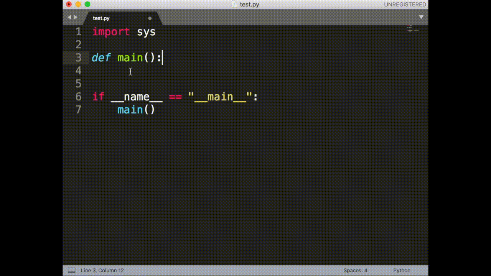
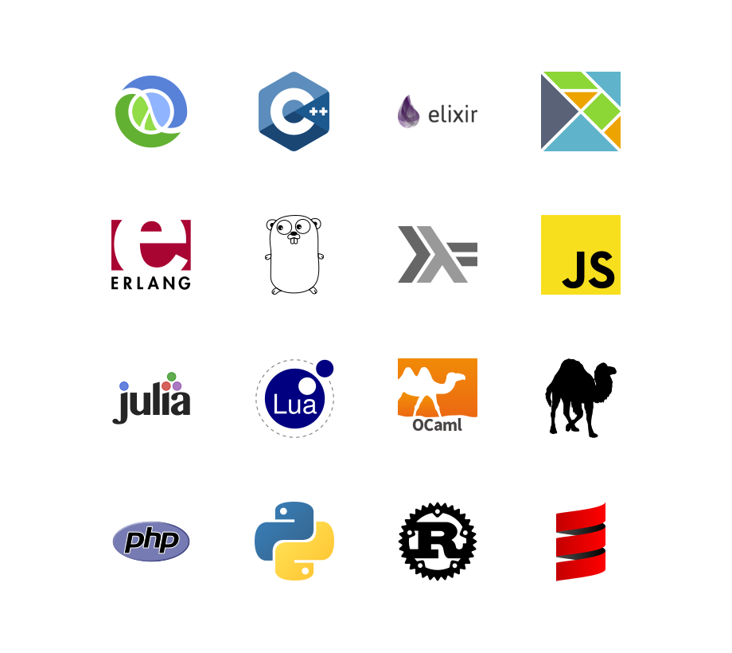

+++
title = "README"
date = 2024-10-10T20:03:04+08:00
weight = 0
type = "docs"
description = ""
isCJKLanguage = true
draft = false

+++

> 原文：[https://github.com/chubin/cheat.sh/blob/master/README.md](https://github.com/chubin/cheat.sh/blob/master/README.md)


Unified access to the best community driven cheat sheets repositories of the world.

​	统一访问世界上最优秀的社区驱动速查表库。

Let's imagine for a moment that there is such a thing as an ideal cheat sheet. What should it look like? What features should it have?

​	让我们设想一下理想的速查表应该是什么样子的？它应该具备哪些特征？

- **Concise** — It should only contain the things you need, and nothing else.
- **简明** — 只包含你需要的内容，别无其他。

- **Fast** — It should be possible to use it instantly.
- **快速** — 应该能够立即使用。
- **Comprehensive** — It should contain answers for every possible question.
- **全面** — 能回答所有可能的问题。
- **Universal** — It should be available everywhere, anytime, without any preparations.
- **通用** — 应该随时随地都能访问，不需要任何准备。
- **Unobtrusive** — It should not distract you from your main task.
- **不打扰** — 不应干扰你正在做的主要任务。
- **Tutoring** — It should help you to learn the subject.
- **教学** — 应该帮助你学习该主题。
- **Inconspicuous** — It should be possible to use it completely unnoticed.
- **低调** — 应该可以在不引人注意的情况下使用。

Such a thing exists! It's easy to [install](https://github.com/chubin/cheat.sh#installation) and there's even [auto-complete](https://github.com/chubin/cheat.sh#tab-completion).

​	这样的工具是存在的！而且安装很简单，甚至还支持[自动补全](https://github.com/chubin/cheat.sh#tab-completion)。

## Features


**cheat.sh**

- Has a simple curl/browser/editor interface.
- Covers 56 programming languages, several DBMSes, and more than 1000 most important UNIX/Linux commands.
- Provides access to the best community driven cheat sheets repositories in the world, on par with StackOverflow.
- Available everywhere, no installation needed, but can be installed for offline usage.
- Ultrafast, returns answers within 100 ms, as a rule.
- Has a convenient command line client, `cht.sh`, that is very advantageous and helpful, though not mandatory.
- Can be used directly from code editors, without opening a browser and not switching your mental context.
- Supports a special stealth mode where it can be used fully invisibly without ever touching a key and making sounds.

[](https://camo.githubusercontent.com/613161d6a01f384b1ad7b7d7cc153963cb27e151a551f17da612b3c2236c540a/68747470733a2f2f63686561742e73682f66696c65732f64656d6f2d6375726c2e676966)

## Usage


To get a cheat sheet for a UNIX/Linux command from a command line, query the service using `curl` or any other HTTP/HTTPS client specifying the name of the command in the query:

```
    curl cheat.sh/tar
    curl cht.sh/curl
    curl https://cheat.sh/rsync
    curl https://cht.sh/tr
```


As you can see, you can use both HTTPS and HTTP to access the service, and both the long (cheat.sh) and the short (cht.sh) service names.

Here `tar`, `curl`, `rsync`, and `tr` are names of the UNIX/Linux commands you want to get cheat sheets for.

If you don't know the name of the command you need, you can search for it using the `~KEYWORD` notation. For example, to see how you can make `snapshots` of a filesystem/volume/something else:

```
    curl cht.sh/~snapshot
```


[](https://camo.githubusercontent.com/fc50801d7fae059bdc278a73e65f6c5c4f84656ff2b3f43acfb6fb91bf4e38b5/68747470733a2f2f63686561742e73682f66696c65732f6368742e73682d75726c2d7374727563747572652e706e67)

The programming language cheat sheets are located in special namespaces dedicated to them.

```
    curl cht.sh/go/Pointers
    curl cht.sh/scala/Functions
    curl cht.sh/python/lambda
```


To get the list of available programming language cheat sheets, use the special query `:list`:

```
    curl cht.sh/go/:list
```


Almost each programming language has a special page named `:learn` that describes the language basics (that's a direct mapping from the *"Learn X in Y"* project). It could be a good starting point if you've just started learning a language.

If there is no cheat sheet for a programming language query (and it is almost always the case), it is generated on the fly, based on available cheat sheets and answers on StackOverflow. Of course, there is no guarantee that the returned cheat sheet will be a 100% hit, but it is almost always exactly what you are looking for.

Try these (and your own) queries to get the impression of that, what the answers look like:

```
    curl cht.sh/go/reverse+a+list
    curl cht.sh/python/random+list+elements
    curl cht.sh/js/parse+json
    curl cht.sh/lua/merge+tables
    curl cht.sh/clojure/variadic+function
```


If you don't like an answer for your queries, you can pick another one. For that, repeat the query with an additional parameter `/1`, `/2` etc. appended:

```
    curl cht.sh/python/random+string
    curl cht.sh/python/random+string/1
    curl cht.sh/python/random+string/2
```


Cheat sheets are formatted as code of the queried programming language (at least we are trying our best to do so) so they can be pasted into a program in this language directly. Text comments, if there are any, are formatted according to the language syntax.

```
    $ curl cht.sh/lua/table+keys
    -- lua: retrieve list of keys in a table

    local keyset={}
    local n=0

    for k,v in pairs(tab) do
      n=n+1
      keyset[n]=k
    end

    --[[
       [ Note that you cannot guarantee any order in keyset. If you want the
       [ keys in sorted order, then sort keyset with table.sort(keyset).
       [ 
       [ [lhf] [so/q/12674345] [cc by-sa 3.0]
       ]]
```


If you don't need text comments in the answer, you can eliminate them using a special option `\?Q`:

```
    $ curl cht.sh/lua/table+keys\?Q
    local keyset={}
    local n=0

    for k,v in pairs(tab) do
      n=n+1
      keyset[n]=k
    end
```


And if you don't need syntax highlighting, switch it off using `\?T`. You can combine the options together:

```
    curl cht.sh/go/reverse+a+list\?Q
    curl cht.sh/python/random+list+elements\?Q
    curl cht.sh/js/parse+json\?Q
    curl cht.sh/lua/merge+tables\?QT
    curl cht.sh/clojure/variadic+function\?QT
```


Full list of all options described below and in `/:help`.

Try your own queries. Follow these rules:

1. Try to be more specific (`/python/append+file` is better than `/python/file` and `/python/append`).
2. Ask practical question if possible (yet theoretical question are possible too).
3. Ask programming language questions only; specify the name of the programming language as the section name.
4. Separate words with `+` instead of spaces.
5. Do not use special characters, they are ignored anyway.
6. If you want to eliminate cheat sheets containing some word, add it to the query with `+-`: `python/multiply+matrices+-numpy`

Read more about the programming languages queries below.

------

## Command line client, cht.sh


The cheat.sh service has its own command line client (`cht.sh`) that has several useful features compared to querying the service directly with `curl`:

- Special shell mode with a persistent queries context and readline support.
- Queries history.
- Clipboard integration.
- Tab completion support for shells (bash, fish, zsh).
- Stealth mode.

### Installation


To install the client:

```
PATH_DIR="$HOME/bin"  # or another directory on your $PATH
mkdir -p "$PATH_DIR"
curl https://cht.sh/:cht.sh > "$PATH_DIR/cht.sh"
chmod +x "$PATH_DIR/cht.sh"
```


or to install it globally (for all users):

```
curl -s https://cht.sh/:cht.sh | sudo tee /usr/local/bin/cht.sh && sudo chmod +x /usr/local/bin/cht.sh
```


Note: The package "rlwrap" is a required dependency to run in shell mode. Install this using `sudo apt install rlwrap`

### Client usage


Now, you can use `cht.sh` instead of `curl`, and write your queries in more natural way, with spaces instead of `+`:

```
    $ cht.sh go reverse a list
    $ cht.sh python random list elements
    $ cht.sh js parse json
```


It is even more convenient to start the client in a special shell mode:

```
    $ cht.sh --shell
    cht.sh> go reverse a list
```


If all your queries are about the same language, you can change the context and spare repeating the programming language name:

```
    $ cht.sh --shell
    cht.sh> cd go
    cht.sh/go> reverse a list
```


or even start the client in this context:

```
    $ cht.sh --shell go
    cht.sh/go> reverse a list
    ...
    cht.sh/go> join a list
    ...
```


If you want to change the context, you can do it with the `cd` command, or if you want do a single query for some other language, just prepend it with `/`:

```
    $ cht.sh --shell go
    ...
    cht.sh/go> /python dictionary comprehension
    ...
```


If you want to copy the last answer into the clipboard, you can use the `c` (`copy`) command, or `C` (`ccopy`, without comments).

```
    cht.sh/python> append file
    #  python - How do you append to a file?

    with open("test.txt", "a") as myfile:
        myfile.write("appended text")
    cht.sh/python> C
    copy: 2 lines copied to the selection
```


Type `help` for other internal `cht.sh` commands.

```
	cht.sh> help
	help    - show this help
	hush    - do not show the 'help' string at start anymore
	cd LANG - change the language context
	copy    - copy the last answer in the clipboard (aliases: yank, y, c)
	ccopy   - copy the last answer w/o comments (cut comments; aliases: cc, Y, C)
	exit    - exit the cheat shell (aliases: quit, ^D)
	id [ID] - set/show an unique session id ("reset" to reset, "remove" to remove)
	stealth - stealth mode (automatic queries for selected text)
	update  - self update (only if the scriptfile is writeable)
	version - show current cht.sh version
	/:help  - service help
	QUERY   - space separated query staring (examples are below)
				  cht.sh> python zip list
				  cht.sh/python> zip list
				  cht.sh/go> /python zip list
```


The `cht.sh` client has its configuration file which is located at `~/.cht.sh/cht.sh.conf` (location of the file can be overridden by the environment variable `CHTSH_CONF`). Use it to specify query options that you would use with each query. For example, to switch syntax highlighting off create the file with the following content:

```
CHTSH_QUERY_OPTIONS="T"
```


Or if you want to use a special syntax highlighting theme:

```
CHTSH_QUERY_OPTIONS="style=native"
```


(`curl cht.sh/:styles-demo` to see all supported styles).

Other cht.sh configuration parameters:

```
CHTSH_CURL_OPTIONS="-A curl"        # curl options used for cht.sh queries
CHTSH_URL=https://cht.sh            # URL of the cheat.sh server
```


### Tab completion


#### Bash Tab completion


To activate tab completion support for `cht.sh`, add the `:bash_completion` script to your `~/.bashrc`:

```
    curl https://cheat.sh/:bash_completion > ~/.bash.d/cht.sh
    . ~/.bash.d/cht.sh
    # and add . ~/.bash.d/cht.sh to ~/.bashrc
```


#### ZSH Tab completion


To activate tab completion support for `cht.sh`, add the `:zsh` script to the *fpath* in your `~/.zshrc`:

```
    curl https://cheat.sh/:zsh > ~/.zsh.d/_cht
    echo 'fpath=(~/.zsh.d/ $fpath)' >> ~/.zshrc
    # Open a new shell to load the plugin
```


------

### Stealth mode


Being used fully unnoticed is one of the most important property of any cheat sheet.

cheat.sh can be used completely unnoticed too. The cheat.sh client, `cht.sh`, has a special mode, called **stealth mode**. Using that, you don't even need to touch your keyboard to open a cheat sheet.

In this mode, as soon as you select some text with the mouse (and thus adding it into the selection buffer of X Window System or into the clipboard) it's used as a query string for cheat.sh, and the correspondent cheat sheet is automatically shown.

Let's imagine, that you are having an online interview, where your interviewer asks you some questions using a shared document (say Google Docs) and you are supposed to write your coding answers there (it's possible too that you'll type in the questions on your own, just to show to the interviewer that you've heard it right).

When using the stealth mode of `cht.sh`, the only thing you need to do in order to see a cheat sheet for some question, is to select the question using the mouse. If you don't want any text in the answers and the only thing you need is code, use the `Q` option when starting the stealth mode.

[](https://camo.githubusercontent.com/95789cc483dbe4f4198a81714580a410ddb5efa1d0909c2ece1ecbb589cd5e5c/68747470733a2f2f63686561742e73682f66696c65732f737465616c74682d6d6f64652e676966)

```
You: Hi!                                            | $ cht.sh --shell python
She: Hi!                                            | cht.sh/python> stealth Q
She: Are you ready for a small interview?           | stealth: you are in the stealth mode; select any text
She: Just a couple of questions                     | stealth: selections longer than 5 words are ignored
She: We will talk about python                      | stealth: query arguments: ?Q
She: Let's start from something simple.             | stealth: use ^C to leave this mode
She: Do you know how to reverse a list in python?   |
You: Sure                                           |
You: (selecting "reverse a list")                   | stealth: reverse a list
                                                    | reverse_lst = lst[::-1]
You: lst[::-1]?                                     |
She: Good.                                          |
She: Do you know how to chain a list of lists?      |
You: (selecting "chain a list of lists")            | stealth: chain a list of lists
                                                    | import itertools
                                                    | a = [["a","b"], ["c"]]
                                                    | print list(itertools.chain.from_iterable(a))
You: May I use external modules?                    |
She: What module do you want to use?                |
You: itertools                                      |
She: Yes, you may use it                            |
You: Ok, then:                                      |
You: itertools.chain.from_iterable(a)               |
She: Good. Let's try something harder.              |
She: What about quicksort implementation?           |
You: (selecting "quicksort implementation")         | stealth: quicksort implementation
You: Let me think about it.                         | (some big and clumsy lowlevel implementation shown)
You: Well...(starting typing it in)                 | def sort(array=[12,4,5,6,7,3,1,15]):
                                                    |     less = []
She: (seeing your ugly pascal style)                |     equal = []
She: Could you write it more concise?               |     greater = []
                                                    |     if len(array) > 1:
You: What do you mean?                              |         pivot = array[0]
                                                    |         for x in array:
She: I mean,                                        |             if x < pivot: less.append(x)
She: do you really need all these ifs and fors?     |             if x == pivot: equal.append(x)
She: Could you maybe just use filter instead?       |             if x > pivot: greater.append(x)
                                                    |         return sort(less)+equal+sort(greater)
You: quicksort with filter?                         |     else:
                                                    |         return array
She: Yes                                            |
You: (selecting "quicksort with filter")            | stealth: quicksort with filter
You: Ok, I will try.                                | return qsort(filter(lt, L[1:]))+[pivot] \
You: Something like this?                           |     +qsort(filter(ge, L[1:]))
You: qsort(filter(lt, L[1:]))+[pivot] \             |
       + qsort(filter(ge, L[1:]))                   |
                                                    |
She: Yes! Perfect! Exactly what I wanted to see!    |
                                                    |
```


Of course, this is just for fun, and you should never cheat in your coding interviews, because you know what happens when you do.

[](https://camo.githubusercontent.com/22542789fb16089c6f837f438c191019a0375c9d4fd0a4e248c87406e8475f20/687474703a2f2f63686561742e73682f66696c65732f7768656e2d796f752d6c69652d6b61747a652e706e67)

### Windows command line client


You can access cheat.sh from Windows command line too.

Use cheat.sh command line client for that: [`cht.exe`](https://github.com/tpanj/cht.exe). It supports:

- output colorization;
- command line options;
- its own configuration file.

You can also use [`scoop`](https://github.com/lukesampson/scoop) command-line installer for Windows to get it:

```
scoop install cht
```


------

## Self-Hosting


### Docker


Currently, the easiest way to get a self-hosted instance running is by using the `docker-compose.yml` file.

```
docker-compose up
```


This builds and runs the image with baked in cheatsheets and starts the app and a Redis instance to back it, making the service available at [http://localhost:8002](http://localhost:8002/) This is currently an early implementation and should probably not be used for anything outside of internal/dev/personal use right now.

## Editors integration


You can use *cheat.sh* directly from the editor (*Emacs*, *Sublime*, *Vim*, and *Visual Studio Code* are currently supported; not all features are supported by all plugins though; see below). Instead of opening your browser, googling, browsing Stack Overflow and eventually copying the code snippets you need into the clipboard and later pasting them into the editor, you can achieve the same instantly and without leaving the editor at all!

Here is what it looks like in Vim:

1. If you have a question while editing a program, you can just type your question directly in the buffer and press `<leader>KK`. You will get the answer to your question in pager. (with `<leader>KB` you'll get the answer in a separate buffer).
2. If you like the answer, you can manually paste it from the buffer or the pager, or if you are lazy you can use `<leader>KP` to paste it below/under your question (or replace you question using `<leader>KR`). If you want the answer without the comments, `<leader>KC` replays the last query toggling them.

If you use some static analysis plugin such as *syntastic* (for Vim), you can use its warning and error messages as cheat.sh queries: place the cursor on the problem line and press `<leader>KE`: explanation for the warning will be opened in a new buffer.

Features supported by cheat.sh plugins for different editors:

| Feature             | Emacs | Sublime | Vim  | VSCode | IDEA | QtCreator |
| ------------------- | ----- | ------- | ---- | ------ | ---- | --------- |
| Command queries     | ✓     | ✓       | ✓    | ✓      | ✓    | ✓         |
| Queries from buffer |       |         | ✓    | ✓      |      | ✓         |
| Toggle comments     |       |         | ✓    | ✓      | ✓    | ✓         |
| Prev/next answer    |       |         | ✓    | ✓      | ✓    | ✓         |
| Multiple answers    |       | ✓       |      |        | ✓    |           |
| Warnings as queries |       |         | ✓    |        |      |           |
| Queries history     |       |         | ✓    | ✓      |      |           |
| Session id          |       |         | ✓    |        |      |           |
| Configurable server | ✓     |         | ✓    | ✓      |      | ✓         |

### Vim


- [cheat.sh-vim](https://github.com/dbeniamine/cheat.sh-vim) — Vim support

Here is Vim configuration example:

```
" some configuration above ...

let mapleader=" "

call vundle#begin()
Bundle 'gmarik/vundle'
Bundle 'scrooloose/syntastic'
Bundle 'dbeniamine/cheat.sh-vim'
call vundle#end()

let g:syntastic_javascript_checkers = [ 'jshint' ]
let g:syntastic_ocaml_checkers = ['merlin']
let g:syntastic_python_checkers = ['pylint']
let g:syntastic_shell_checkers = ['shellcheck']

" some configuration below ...
```


In this example, several Vim plugins are used:

- [gmarik/vundle](https://github.com/VundleVim/Vundle.vim) — Vim plugin manager
- [scrooloose/syntastic](https://github.com/vim-syntastic/syntastic) — Syntax checking plugin
- [cheat.sh-vim](https://github.com/dbeniamine/cheat.sh-vim) — Vim support

Syntastic shows warnings and errors (found by code analysis tools: `jshint`, `merlin`, `pylint`, `shellcheck` etc.), and `cheat.sh-vim` shows you explanations for the errors and warnings and answers on programming languages queries written in the editor.

Watch a demo, where the most important features of the cheat.sh Vim plugin are shown (5 Min):

[](https://camo.githubusercontent.com/fcfe136eadd4c0093f60904e59470de0b0212aa6fc92274cc76d7017e00fc227/68747470733a2f2f63686561742e73682f66696c65732f76696d2d64656d6f2e676966)

Or, if you want to scroll and/or pause, the same on YouTube:

[](http://www.youtube.com/watch?feature=player_embedded&v=xyf6MJ0y-z8)

### Emacs


- [cheat-sh.el](https://github.com/davep/cheat-sh.el) — Emacs support (available also at cheat.sh/:emacs)
- cheat.sh/:emacs-ivy — Emacs support for ivy users

[](https://asciinema.org/a/3xvqwrsu9g4taj5w526sb2t35)

### Visual Studio Code


- [vscode-snippet](https://github.com/mre/vscode-snippet)
- Install it from [VSCode Marketplace](https://marketplace.visualstudio.com/items?itemName=vscode-snippet.Snippet)

Usage:

1. Hit ⌘ Command + ⇧ Shift + p
2. Run `Snippet: Find`.
3. Type your query and hit enter.

[](https://github.com/mre/vscode-snippet)

*(GIF courtesy: Matthias Endler, @mre)*

### Sublime


- [cheat.sh-sublime-plugin](https://github.com/gauravk-in/cheat.sh-sublime-plugin/)

Usage:

1. Write your query string.
2. Select the query string.
3. Press Cmd + ⇧ Shift + B to replace the selected query string by the answer generated from `cht.sh`.

[](https://github.com/gauravk-in/cheat.sh-sublime-plugin)

*(GIF courtesy: Gaurav Kukreja, @gauravk-in)*

### IntelliJ IDEA


- [idea-cheatsh-plugin](https://github.com/szymonprz/idea-cheatsh-plugin)
- Install from [idea plugins marketplace](https://plugins.jetbrains.com/plugin/11942-cheat-sh-code-snippets)

Usage:

1. Write query string
2. Select the query string
3. Press keyboard shortcut Alt + C , S to replace the selected query string by the answer

[](https://github.com/szymonprz/idea-cheatsh-plugin)

*(GIF courtesy: Szymon Przebierowski, @szymonprz)*

### QtCreator


- [cheatsh-qtcreator](https://github.com/pozemka/cheatsh-qtcreator)

Current features:

- search word under cursor
- search selected
- query search
- disable comments
- paste answer (?TQ version)
- custom server URL
- custom search context (default is cpp)
- hotkeys and menu

[](https://github.com/pozemka/cheatsh-qtcreator)

*(GIF courtesy: Pozemka, @pozemka)*

## Special pages


There are several special pages that are not cheat sheets. Their names start with colon and have special meaning.

Getting started:

```
    :help               description of all special pages and options
    :intro              cheat.sh introduction, covering the most important usage questions
    :list               list all cheat sheets (can be used in a subsection too: /go/:list)
```


Command line client `cht.sh` and shells support:

```
    :cht.sh             code of the cht.sh client
    :bash_completion    bash function for tab completion
    :bash               bash function and tab completion setup
    :fish               fish function and tab completion setup
    :zsh                zsh function and tab completion setup
```


Editors support:

```
    :vim                cheat.sh support for Vim
    :emacs              cheat.sh function for Emacs
    :emacs-ivy          cheat.sh function for Emacs (uses ivy)
```


Other pages:

```
    :post               how to post new cheat sheet
    :styles             list of color styles
    :styles-demo        show color styles usage examples
    :random             fetches a random page (can be used in a subsection too: /go/:random)
```


## Search


To search for a keyword, use the query:

```
    /~keyword
```


In this case search is not recursive — it is conducted only in a page of the specified level. For example:

```
    /~snapshot          look for snapshot in the first level cheat sheets
    /scala/~currying     look for currying in scala cheat sheets
```


For a recursive search in all cheat sheets, use double slash:

```
    /~snapshot/r         look for snapshot in all cheat sheets
```


You can use special search options after the closing slash:

```
    /~shot/bi           case insensitive (i), word boundaries (b)
```


List of search options:

```
    i   case insensitive search
    b   word boundaries
    r   recursive search
```


## Programming languages cheat sheets


Cheat sheets related to programming languages are organized in namespaces (subdirectories), that are named according to the programming language.

For each supported programming language there are several special cheat sheets: its own sheet, `hello`, `:list` and `:learn`. Say for lua it will look like:

```
    lua
    lua/hello
    lua/:list
    lua/:learn
```


Some languages has the one-liners-cheat sheet, `1line`:

```
    perl/1line
```


- `hello` describes how you can start with the language — install it if needed, build and run its programs, and it shows the "Hello world" program written in the language;
- `:list` shows all topics related to the language
- `:learn` shows a learn-x-in-minutes language cheat sheet perfect for getting started with the language.
- `1line` is a collection of one-liners in this language
- `weirdness` is a collection of examples of weird things in this language

[](https://camo.githubusercontent.com/d992aa0f1206418fa5573c774d8010a55a52f8aa22661658b22cc6df89ccab15/687474703a2f2f63686561742e73682f66696c65732f737570706f727465642d6c616e6775616765732d632b2b2e706e67)

At the moment, cheat.sh covers the 58 following programming languages (alphabetically sorted):

| Prefix         | Language     | Basics | One-liners | Weirdness | StackOverflow |
| -------------- | ------------ | ------ | ---------- | --------- | ------------- |
| `arduino/`     | Arduino      |        |            |           | ✓             |
| `assembly/`    | Assembly     |        |            |           | ✓             |
| `awk/`         | AWK          | ✓      |            |           | ✓             |
| `bash/`        | Bash         | ✓      |            |           | ✓             |
| `basic/`       | BASIC        |        |            |           | ✓             |
| `bf/`          | Brainfuck    | ✓      |            |           | ✓             |
| `c/`           | C            | ✓      |            |           | ✓             |
| `chapel/`      | Chapel       | ✓      |            |           | ✓             |
| `clean/`       | Clean        |        |            |           | ✓             |
| `clojure/`     | Clojure      | ✓      |            |           | ✓             |
| `coffee/`      | CoffeeScript | ✓      |            |           | ✓             |
| `cpp/`         | C++          | ✓      |            |           | ✓             |
| `csharp/`      | C#           | ✓      |            |           | ✓             |
| `d/`           | D            | ✓      |            |           | ✓             |
| `dart/`        | Dart         | ✓      |            |           | ✓             |
| `delphi/`      | Dephi        |        |            |           | ✓             |
| `dylan/`       | Dylan        | ✓      |            |           | ✓             |
| `eiffel/`      | Eiffel       |        |            |           | ✓             |
| `elixir/`      | Elixir       | ✓      |            |           | ✓             |
| `elisp/`       | ELisp        | ✓      |            |           | ✓             |
| `elm/`         | Elm          | ✓      |            |           | ✓             |
| `erlang/`      | Erlang       | ✓      |            |           | ✓             |
| `factor/`      | Factor       | ✓      |            |           | ✓             |
| `fortran/`     | Fortran      | ✓      |            |           | ✓             |
| `forth/`       | Forth        | ✓      |            |           | ✓             |
| `fsharp/`      | F#           | ✓      |            |           | ✓             |
| `go/`          | Go           | ✓      |            |           | ✓             |
| `groovy/`      | Groovy       | ✓      |            |           | ✓             |
| `haskell/`     | Haskell      | ✓      |            |           | ✓             |
| `java/`        | Java         | ✓      |            |           | ✓             |
| `js/`          | JavaScript   | ✓      | ✓          | ✓         | ✓             |
| `julia/`       | Julia        | ✓      |            |           | ✓             |
| `kotlin/`      | Kotlin       | ✓      |            |           | ✓             |
| `latex/`       | LaTeX        | ✓      |            |           | ✓             |
| `lisp/`        | Lisp         | ✓      |            |           | ✓             |
| `lua/`         | Lua          | ✓      |            |           | ✓             |
| `matlab/`      | MATLAB       | ✓      |            |           | ✓             |
| `nim/`         | Nim          | ✓      |            |           | ✓             |
| `ocaml/`       | OCaml        | ✓      |            |           | ✓             |
| `octave/`      | Octave       | ✓      |            |           | ✓             |
| `perl/`        | Perl         | ✓      | ✓          |           | ✓             |
| `perl6/`       | Perl 6       | ✓      | ✓          |           | ✓             |
| `php/`         | PHP          | ✓      |            |           | ✓             |
| `pike/`        | Pike         |        |            |           | ✓             |
| `python/`      | Python       | ✓      | ✓          |           | ✓             |
| `python3/`     | Python 3     | ✓      |            |           | ✓             |
| `r/`           | R            | ✓      |            |           | ✓             |
| `racket/`      | Racket       | ✓      |            |           | ✓             |
| `ruby/`        | Ruby         | ✓      |            |           | ✓             |
| `rust/`        | Rust         | ✓      |            |           | ✓             |
| `scala/`       | Scala        | ✓      |            |           | ✓             |
| `scheme/`      | Scheme       | ✓      |            |           | ✓             |
| `solidity/`    | Solidity     | ✓      |            |           | ✓             |
| `swift/`       | Swift        | ✓      |            |           | ✓             |
| `tcsh/`        | Tcsh         | ✓      |            |           | ✓             |
| `tcl/`         | Tcl          | ✓      |            |           | ✓             |
| `objective-c/` | Objective-C  | ✓      |            |           | ✓             |
| `vb/`          | VisualBasic  | ✓      |            |           | ✓             |
| `vbnet/`       | VB.Net       | ✓      |            |           | ✓             |

And several other topics, that are though related to programming, are not programming languages:

| Prefix    | Topic  | Basics | StackOverflow |
| --------- | ------ | ------ | ------------- |
| `cmake/`  | CMake  | ✓      | ✓             |
| `django/` | Django |        | ✓             |
| `flask/`  | Flask  |        | ✓             |
| `git/`    | Git    | ✓      | ✓             |

## Cheat sheets sources


Instead of creating yet another mediocre cheat sheet repository, we are concentrating our efforts on creation of a unified mechanism to access selected existing well developed and good maintained cheat sheet repositories covering topics of our interest: programming and operating systems usage.

*cheat.sh* uses selected community driven cheat sheet repositories and information sources, maintained by thousands of users, developers and authors all over the world (in the *Users* column number of contributors/number of stars is shown):

| Cheat sheets            | Repository                                                   | C/U*                                                         | Stars                                                        | Creation Date |
| ----------------------- | ------------------------------------------------------------ | ------------------------------------------------------------ | ------------------------------------------------------------ | ------------- |
| UNIX/Linux, programming | [cheat.sheets](https://github.com/chubin/cheat.sheets)       | [](https://camo.githubusercontent.com/e55a23c625b9eca360410778f4926fc0179a52f5fd7d5e4401683c90afc47a61/68747470733a2f2f696d672e736869656c64732e696f2f6769746875622f636f6e7472696275746f72732d616e6f6e2f63687562696e2f63686561742e7368656574733f6c6162656c3d254630253946253931254135266c6162656c436f6c6f723d7768697465) | [](https://camo.githubusercontent.com/32739a4c436298984e9f650859e3a6a825bc80a1a3e1092e86c32ada56179a3f/68747470733a2f2f696d672e736869656c64732e696f2f6769746875622f73746172732f63687562696e2f63686561742e7368656574733f6c6162656c3d254532254144253930266c6162656c436f6c6f723d7768697465) | May 1, 2017   |
| UNIX/Linux commands     | [tldr-pages/tldr](https://github.com/tldr-pages/tldr)        | [](https://camo.githubusercontent.com/80897257282d1ac090b367c779b1d3e053a39c00f3c69f818760acd69b08a836/68747470733a2f2f696d672e736869656c64732e696f2f6769746875622f636f6e7472696275746f72732d616e6f6e2f746c64722d70616765732f746c64723f6c6162656c3d254630253946253931254135266c6162656c436f6c6f723d7768697465) | [](https://camo.githubusercontent.com/45253378e1cd322586dfa52d1367b6920ae4bd0a9610bc07fa4f8575c69a3cae/68747470733a2f2f696d672e736869656c64732e696f2f6769746875622f73746172732f746c64722d70616765732f746c64723f6c6162656c3d254532254144253930266c6162656c436f6c6f723d7768697465) | Dec 8, 2013   |
| UNIX/Linux commands     | [chrisallenlane/cheat](https://github.com/chrisallenlane/cheat) | [](https://camo.githubusercontent.com/645badc06b9ebde5f487b6d8f25a23a94963d129210b539326ba74aa6bd94234/68747470733a2f2f696d672e736869656c64732e696f2f6769746875622f636f6e7472696275746f72732d616e6f6e2f6368726973616c6c656e6c616e652f63686561743f6c6162656c3d254630253946253931254135266c6162656c436f6c6f723d7768697465) | [](https://camo.githubusercontent.com/3cf8ea02b612da756aa9cbf4c0caa6aa56311a9183c42c1ec9d34395a4e65dd7/68747470733a2f2f696d672e736869656c64732e696f2f6769746875622f73746172732f6368726973616c6c656e6c616e652f63686561743f6c6162656c3d254532254144253930266c6162656c436f6c6f723d7768697465) | Jul 28, 2013  |
| Programming languages   | [adambard/learnxinyminutes-docs](https://github.com/adambard/learnxinyminutes-docs) | [](https://camo.githubusercontent.com/80b69e9b3409ea321e0c39557141b0ee30c45a65d69fef36997e9c7f9db5c681/68747470733a2f2f696d672e736869656c64732e696f2f6769746875622f636f6e7472696275746f72732d616e6f6e2f6164616d626172642f6c6561726e78696e796d696e757465732d646f63733f6c6162656c3d254630253946253931254135266c6162656c436f6c6f723d7768697465) | [](https://camo.githubusercontent.com/f4a619d0d424d04a08b941a11ec2aea40a3a757aa3c78084386b4bc92c530e46/68747470733a2f2f696d672e736869656c64732e696f2f6769746875622f73746172732f6164616d626172642f6c6561726e78696e796d696e757465732d646f63733f6c6162656c3d254532254144253930266c6162656c436f6c6f723d7768697465) | Jun 23, 2013  |
| Go                      | [a8m/go-lang-cheat-sheet](https://github.com/a8m/go-lang-cheat-sheet) | [](https://camo.githubusercontent.com/918c0b2009d899b8db2430f7a4b00e8b1ebb9692c76d9df95da814cf6ceb280b/68747470733a2f2f696d672e736869656c64732e696f2f6769746875622f636f6e7472696275746f72732d616e6f6e2f61386d2f676f2d6c616e672d63686561742d73686565743f6c6162656c3d254630253946253931254135266c6162656c436f6c6f723d7768697465) | [](https://camo.githubusercontent.com/8ed6e67c69af8c533c8422d2b5c8db9a4b9906b354f55fde60f94ef81d3c1090/68747470733a2f2f696d672e736869656c64732e696f2f6769746875622f73746172732f61386d2f676f2d6c616e672d63686561742d73686565743f6c6162656c3d254532254144253930266c6162656c436f6c6f723d7768697465) | Feb 9, 2014   |
| Perl                    | [pkrumnis/perl1line.txt](https://github.com/pkrumins/perl1line.txt) | [](https://camo.githubusercontent.com/2dfd31cfb7eeea74abdc626a17a7789c1d967543fde469c915e14c49544b8866/68747470733a2f2f696d672e736869656c64732e696f2f6769746875622f636f6e7472696275746f72732d616e6f6e2f706b72756d696e732f7065726c316c696e652e7478743f6c6162656c3d254630253946253931254135266c6162656c436f6c6f723d7768697465) | [](https://camo.githubusercontent.com/20cb31fd0a38b485000e0ad802ad219c59721c30d7114c516c1053732b6787a3/68747470733a2f2f696d672e736869656c64732e696f2f6769746875622f73746172732f706b72756d696e732f7065726c316c696e652e7478743f6c6162656c3d254532254144253930266c6162656c436f6c6f723d7768697465) | Nov 4, 2011   |
| Programming languages   | [StackOverflow](https://stackoverflow.com/)                  | [14M](https://stackexchange.com/leagues/1/alltime/stackoverflow) | N/A                                                          | Sep 15, 2008  |

(*) C/U — contributors for GitHub repositories, Users for Stackoverflow

Pie diagram reflecting cheat sheets sources distribution (by number of cheat sheets on cheat.sh originating from a repository):

[](https://camo.githubusercontent.com/2d4168f0e7c1fed2094694791fbfe36cc61808ba15d81b295a88080f90c61301/687474703a2f2f63686561742e73682f66696c65732f737461742d323031372d30362d30352e706e67)

## How to contribute


### How to edit a cheat sheet


If you want to edit a cheat.sh cheat sheet, you should edit it in the upstream repository. You will find the name of the source repository in a browser when you open a cheat sheet. There are two github buttons at the bottom of the page: the second one is the button of the repository, which belongs the current cheat sheet.

You can edit the cheat sheet directly in your browser (you need a github account for it). There is an edit button in the top right corner. If you click on it, an editor will be open. There you will change the cheat sheet (under the hood: the upstream repository is forked, your changes are committed in the forked repository, a pull request to the upstream repository owner is sent).

[](https://camo.githubusercontent.com/e18bbd2d9fa04fd602771d34df7c0193835849ebb8fc14ace01ac930eacc2ae9/687474703a2f2f63686561742e73682f66696c65732f656469742d63686561742d73686565742e706e67)

### How to add a cheat sheet


If you want to add a cheat sheet, you have one of the following ways:

- Add it to one of the external cheat sheets repositories; you should decide on your own what is the best repository for your cheat sheet;
- Add it to the local cheat.sh repository ([cheat.sheets](https://github.com/chubin/cheat.sheets)) on github (fork, commit, pull request);
- Post it on cheat.sh using curl or a web browser ([cheat.sh/:post](http://cheat.sh/:post)).

If you want to change an existing cheat sheet, you have to find the original repository (when you open a cheat sheet in a browser, you see the repository's github button in the bottom of the cheat sheet), the cheat sheet is coming from, and change it there. After some time the changes will be synchronized on cheat.sh.

### How to add a cheat sheet repository


If you want to add a cheat sheet repository to cheat.sh, please open an issue:

- [Add a new repository](https://github.com/chubin/cheat.sh/issues/new)

Please specify the name of the repository, and give its short description.

## Installation and standalone usage


You don't need to install anything, to start using *cheat.sh*.

There are two cases, when you want to install *cheat.sh* locally:

1. You plan to use it off-line, without Internet access;
2. You want to use your own cheat sheets (additionally, or as a replacement).

Installation process in described in details here: [cheat.sh standalone installation](https://github.com/chubin/cheat.sh/blob/master/doc/standalone.md)